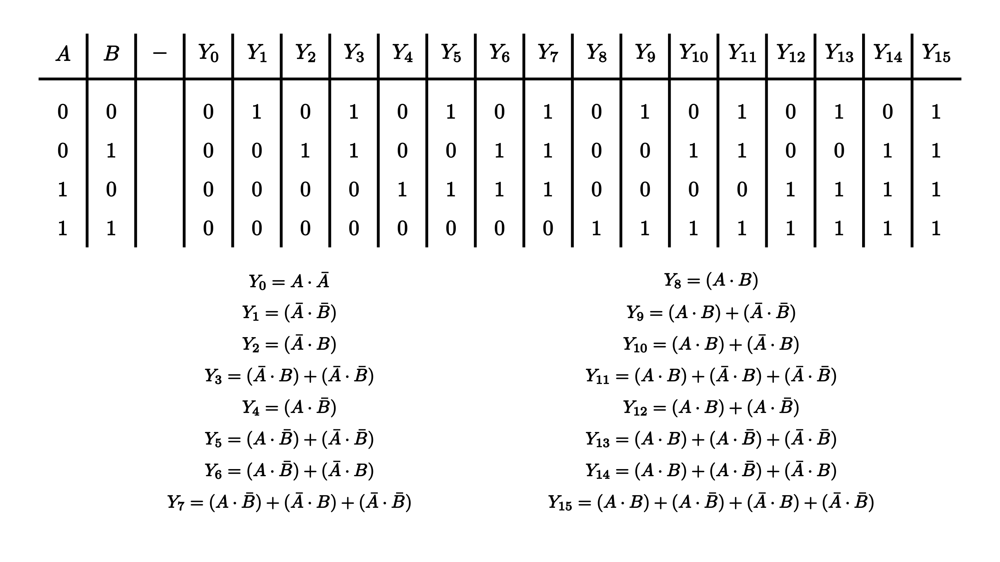
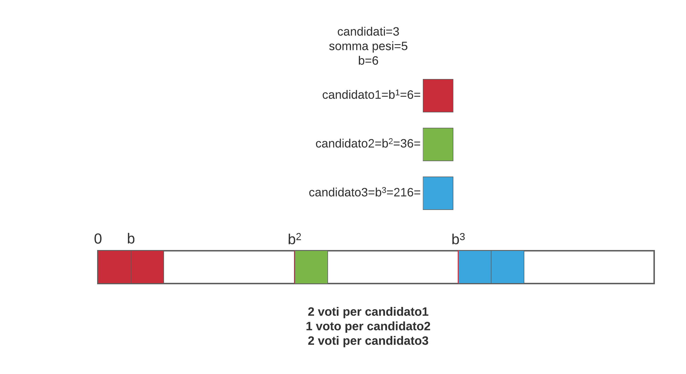
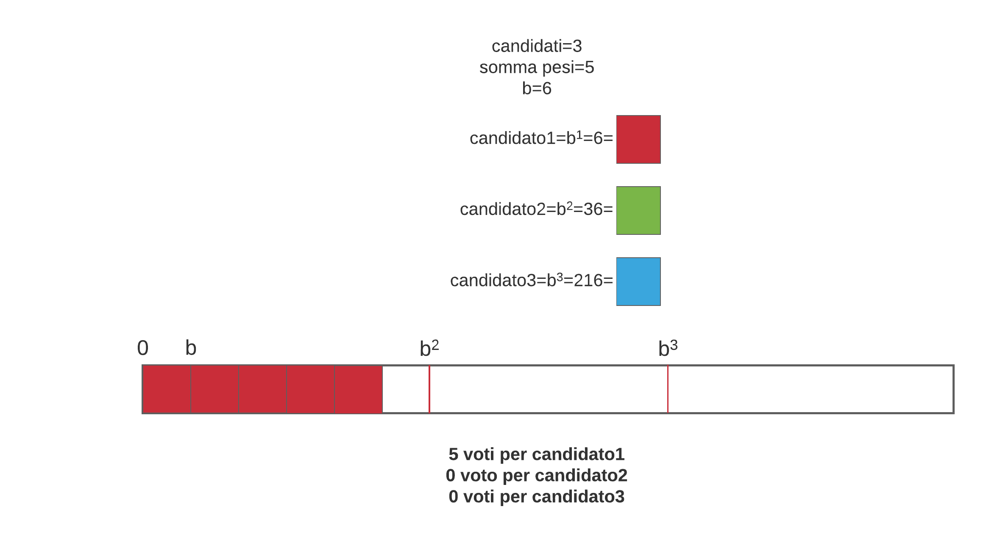
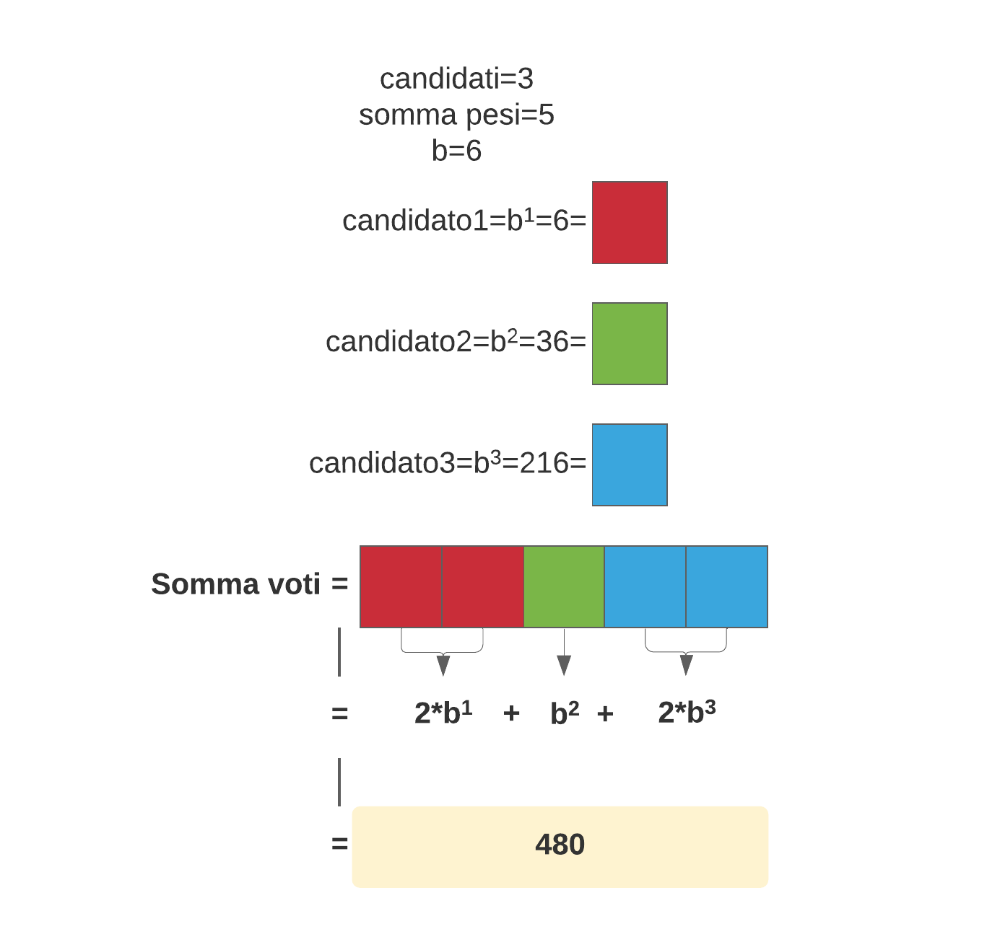

# Indice <!-- omit in toc -->
- [1. Introduzione](#1-introduzione)
- [2. Variabili e simbologia](#2-variabili-e-simbologia)
- [3. Requisiti di aritmetica modulare e teoria dei numeri e dei gruppi](#3-requisiti-di-aritmetica-modulare-e-teoria-dei-numeri-e-dei-gruppi)
  - [3.1. Biettività](#31-biettività)
  - [3.2. Funzione toziente di Eulero](#32-funzione-toziente-di-eulero)
    - [3.2.1. Proprietà moltiplicativa di $\phi$](#321-proprietà-moltiplicativa-di-phi)
    - [3.2.2. Valore di $\phi$ per una potenza di un numero primo](#322-valore-di-phi-per-una-potenza-di-un-numero-primo)
    - [3.2.3. Valore di $\phi$ per il quadrato di un composto](#323-valore-di-phi-per-il-quadrato-di-un-composto)
    - [3.2.4. Valore di $\phi$ come esponente](#324-valore-di-phi-come-esponente)
  - [3.3. Teorema binomiale in modulo](#33-teorema-binomiale-in-modulo)
  - [3.4. Ordine di un intero in modulo](#34-ordine-di-un-intero-in-modulo)
  - [3.5. Classi di resto](#35-classi-di-resto)
  - [3.6. Anello degli interi di $n$](#36-anello-degli-interi-di-n)
  - [3.7. Sistema ridotto di classi di resto](#37-sistema-ridotto-di-classi-di-resto)
  - [3.8. Inverso moltiplicativo](#38-inverso-moltiplicativo)
  - [3.9. Set generatore e radici primitive](#39-set-generatore-e-radici-primitive)
  - [3.10. Gruppi ciclici](#310-gruppi-ciclici)
  - [3.11. Funzione di Carmichael](#311-funzione-di-carmichael)
    - [3.11.1. Funzione di Carmichael di una potenza prima](#3111-funzione-di-carmichael-di-una-potenza-prima)
    - [3.11.2. Funzione di Carmichael di un composto](#3112-funzione-di-carmichael-di-un-composto)
    - [3.11.3. Funzione di Carmichael del quadrato di un composto](#3113-funzione-di-carmichael-del-quadrato-di-un-composto)
  - [3.12. Resto quadratico](#312-resto-quadratico)
    - [3.12.1. Resto quadratico di modulo primo $p$](#3121-resto-quadratico-di-modulo-primo-p)
    - [3.12.2. Simbolo di Legendre](#3122-simbolo-di-legendre)
    - [3.12.3. Resto qudratico di modulo potenza prima $p^k$](#3123-resto-qudratico-di-modulo-potenza-prima-pk)
    - [3.12.4. Resto quadratico di modulo composto $n$](#3124-resto-quadratico-di-modulo-composto-n)
    - [3.12.5. Simbolo di Jacobi](#3125-simbolo-di-jacobi)
  - [3.13. Problema dei resti quadrati](#313-problema-dei-resti-quadrati)
  - [3.14. Resto d-esimo](#314-resto-d-esimo)
  - [3.15. Problema dei resti d-esimi](#315-problema-dei-resti-d-esimi)
- [4. Crittografia omomorfica](#4-crittografia-omomorfica)
  - [4.1. Stroia](#41-stroia)
  - [4.2. Applicazioni](#42-applicazioni)
  - [4.3. Computazioni e circuiti logici](#43-computazioni-e-circuiti-logici)
  - [4.4. Tipologie di schemi omomorfici](#44-tipologie-di-schemi-omomorfici)
    - [4.4.1. Parzialmente omomorfici](#441-parzialmente-omomorfici)
    - [4.4.2. Quasi pienamente omomorfici](#442-quasi-pienamente-omomorfici)
    - [4.4.3. Pienamente omomorfici](#443-pienamente-omomorfici)
- [5. Schema crittografico di Paillier](#5-schema-crittografico-di-paillier)
  - [5.1. Funzione L](#51-funzione-l)
  - [5.2. $G$: generazione chiave](#52-g-generazione-chiave)
  - [5.3. $E_{k^+}$: cifratura](#53-e_k-cifratura)
  - [5.4. $D_{k^-}$: decifratura](#54-d_k--decifratura)
  - [5.5. Matematica dietro le quinte](#55-matematica-dietro-le-quinte)
    - [5.5.1. Biettività di $E_{k^+}$](#551-biettività-di-e_k)
    - [5.5.2. Dimostrazione della formula di decifratura $D_{k^-}$](#552-dimostrazione-della-formula-di-decifratura-d_k-)
      - [5.5.2.1. Classi di resto d-esimi](#5521-classi-di-resto-d-esimi)
      - [5.5.2.2. Formula di decifratura con classi di resto d-esime](#5522-formula-di-decifratura-con-classi-di-resto-d-esime)
        - [5.5.2.2.1. $L(g^{\lambda(n)} \bmod n^2)^{-1}$](#55221-lglambdan-bmod-n2-1)
        - [5.5.2.2.2. $L(c^{\lambda(n) \bmod n^2})$](#55222-lclambdan-bmod-n2)
        - [5.5.2.2.3. equivalenza di prodotto](#55223-equivalenza-di-prodotto)
  - [5.6. Proprietà omomorfiche](#56-proprietà-omomorfiche)
    - [5.6.1. Moltiplicazione cifrati](#561-moltiplicazione-cifrati)
    - [5.6.2. Esponenziazzione cifrato-chiaro](#562-esponenziazzione-cifrato-chiaro)
    - [5.6.3. Auto-offuscamento](#563-auto-offuscamento)
  - [5.7. Sicurezza](#57-sicurezza)
    - [5.7.1. Cifratura di 0](#571-cifratura-di-0)
    - [5.7.2. Cifratura di un non nullo](#572-cifratura-di-un-non-nullo)
- [6. Dimostrazione pratica: voto elettronico](#6-dimostrazione-pratica-voto-elettronico)
  - [6.1. Importanza del voto elettronico](#61-importanza-del-voto-elettronico)
  - [6.2. Insidie e stato dell'arte](#62-insidie-e-stato-dellarte)
  - [6.3. Minosse](#63-minosse)
    - [6.3.1. Descrizione](#631-descrizione)
    - [6.3.2. Architettura e implementazioni di base del sistema](#632-architettura-e-implementazioni-di-base-del-sistema)
      - [6.3.2.1. Affidabilità e trasparenza](#6321-affidabilità-e-trasparenza)
      - [6.3.2.2. Graphic User Interface](#6322-graphic-user-interface)
      - [6.3.2.3. Generalizzazioni](#6323-generalizzazioni)
        - [6.3.2.3.1. Multipli candidati](#63231-multipli-candidati)
      - [6.3.2.4. Voti ponderati](#6324-voti-ponderati)
      - [6.3.2.5. Votare](#6325-votare)
        - [6.3.2.5.1. Valore del voto](#63251-valore-del-voto)
          - [6.3.2.5.1.1. Base e massimo numero di voti](#632511-base-e-massimo-numero-di-voti)
          - [6.3.2.5.1.2. Esponente delle opzioni](#632512-esponente-delle-opzioni)
          - [6.3.2.5.1.3. Somma dei voti](#632513-somma-dei-voti)
          - [6.3.2.5.1.4. Formula Inversa](#632514-formula-inversa)
        - [6.3.2.5.2. Voto segreto](#63252-voto-segreto)
        - [6.3.2.5.3. Ricevuta di voto](#63253-ricevuta-di-voto)
      - [6.3.2.6. Verifica voti e risultati Real-Time](#6326-verifica-voti-e-risultati-real-time)
    - [6.3.3. Sviluppo e tecnologie](#633-sviluppo-e-tecnologie)
      - [6.3.3.1. Server e Client](#6331-server-e-client)
      - [6.3.3.2. Librerie e moduli utilizzati](#6332-librerie-e-moduli-utilizzati)
      - [6.3.3.3. Condivisione dati](#6333-condivisione-dati)
        - [6.3.3.3.1. Serializzazione: BigInt e JSON](#63331-serializzazione-bigint-e-json)
      - [6.3.3.4. Configurazione](#6334-configurazione)
      - [6.3.3.5. Licenza](#6335-licenza)
  - [6.4. Problemi e vulnerabilità](#64-problemi-e-vulnerabilità)
    - [6.4.1. Vulnerabilità tecniche](#641-vulnerabilità-tecniche)
      - [6.4.1.1. Operazioni a tempo costante e BigInt](#6411-operazioni-a-tempo-costante-e-bigint)
    - [6.4.2. Problemi intrinsechi](#642-problemi-intrinsechi)
      - [6.4.2.1. Problema dei pesi](#6421-problema-dei-pesi)
      - [6.4.2.2. Validità](#6422-validità)
  - [6.5. Test e risultati](#65-test-e-risultati)
  - [6.6. Miglioramenti e sviluppi futuri](#66-miglioramenti-e-sviluppi-futuri)
    - [6.6.1. Login e tracciabilità](#661-login-e-tracciabilità)
    - [6.6.2. Più elezioni contemporaneamente.](#662-più-elezioni-contemporaneamente)
    - [6.6.3. Meccanismo di validità del voto.](#663-meccanismo-di-validità-del-voto)
    - [6.6.4. Safe crittografico](#664-safe-crittografico)
- [7. Conclusioni](#7-conclusioni)
- [8. Bibliografia](#8-bibliografia)

<div style="page-break-after: always; visibility: hidden"> 
</div>

# 1. Introduzione
La crittografia omomorfica è un particolare tipo di cifratura in grado di poter supportare computazioni sui e tra i cifrati e rispecchiare i risultati nei messaggi in chiaro. Allo stato attuale dell'arte questa tecnologia è ancora in sviluppo e ha subito miglioramenti drastici e probabilmente sarà impiegata in importanti applicazioni che rivoluzioneranno il Cloud Computing e i servizi remoti.  
In questo testo si forniscono delle basi adeguate di matemtica, che saranno utilizzate poi per comprendere i principi della crittografia omomorfica e in particolare del sistema crittografico di Paillier fino alla completa comprensione.  
Si hanno poi utilizzato le conoscenze acquisite per costruire una applicazione dimostrativa con lo schema di Paillier sulle elezioni elettroniche con più candidati. Viene descritta tecnicamente la piattaforma e presentati i risultati ottenuti.  

# 2. Variabili e simbologia
 - $\gcd(a, b)$: Greatest Common Divisor (Massimo Comune Denominatore) tra $a$ e $b$.
 - $\mathrm{lcm}(a, b)$: Least Common Multiple (Minimo Comune Multiplo) tra $a$ e $b$.
 - $\mathbf{M}$: Spazio dei messaggi in chiaro.
 - $m$: Variabile aleatoria contenente un messaggio in chiaro. Segue una distribuzione uniforme. 
 - $\mathbf{C}$: spazio dei messaggi cifrati
 - $c$: Variabile aleatoria contenente un messaggio cifrato.
 - $\mathbf{K}$: Spazio contenenti le chiavi.
 - $k^+$: Variabile aleatoria contente una chiave pubblica.
 - $k^-$: Variabile aleatoria contente una chiave privata.
 - $\pi$ Indica lo schema crittografico in uso dal contesto.
 - $G$: funzione per la generazione delle chiavi.
 - $E_{k+}$: $\mathbf{M} \rightarrow \mathbf{C}$ funzione di cifratura con chiave pubblica.
 - $D_{k^-}$: $\mathbf{C} \rightarrow \mathbf{M}$ funzione di decifratura con chiave privata.
 - $\Theta$: Oracolo generico. È possibile interpellarlo e svolge una funzione dipendente dal contesto.

<div style="page-break-after: always; visibility: hidden"> 
</div>

# 3. Requisiti di aritmetica modulare e teoria dei numeri e dei gruppi
## 3.1. Biettività
 - Siano $A = \{a_1, a_2,..,a_s\}$ e $B = \{b_1, b_2,..,b_s\}$ due insiemi con $|A|=|B|=s$ e $f: A \rightarrow B$
> $f$ è iniettiva solo se è surriettiva e viceversa.  
> Di conseguenza, nel caso si dimostrasse che $f$ possiede almeno una di queste due caratteristiche allora si dimostrerebbe che possiede anche l'altra e quindi la biettività.

**Dimostrazione**:  
 - Assumiamo $f$ sia una funzione iniettiva:  
  $f(a_1), f(a_2),..,f(a_s)$ sono $s$ distinti elementi di $B$  
  Siccome $B$ contiene $s$ elementi questi devono essere tutti gli elementi di $B$ in qualche ordine.  
  Dunque ogni elemento di $B$ è raggiunto da almeno un elemento di $A$ e quindi $f$ è anche surriettiva.
 - Assumiamo $f$ sia una funzione suriettiva:  
  Ogni elemento di $A$ ha una e una sola immagine.  
  Siccome $f$ è suriettiva ogni elemento di $B$ è ottenuto da almeno un elemento di $A$.  
  Esisteranno quindi almeno $s$ elementi di $A$ diversi attraverso i quali ottenere tutti gli elementi di $B$.  
  Siccome $A$ ha proprio cardinalità $s$ allora questi sono proprio tutti i diversi elementi di $A$ e nessun elemento di $B$ sarà ottenibile da due elementi di $A$ diversi. Quindi $f$ è anche iniettiva. 
## 3.2. Funzione toziente di Eulero
$$\phi(n) = n \prod_{p | n}(1 - \frac{1}{p})$$
La funzione toziente di Eulero indica la quantità di numeri minori di $n$ e coprimi con questo: $|\{\forall \ m < n: \gcd(n, m) = 1\}|$  
**Dimostrazione**:  
 - Si assume che i numeri coprimi con $n$ siano $n$
 - Da $n$ si dividono (tolgono) tutti i multipli dei numeri primi fino a $n$

<div style="page-break-after: always; visibility: hidden"> 
</div>

### 3.2.1. Proprietà moltiplicativa di $\phi$
- Siano $a$ e $b$ due numeri naturali coprimi fra loro
$$\phi(ab) = \phi(a)*\phi(b)$$  
**Dimostrazione**:    
$$\phi(a) = a \prod_{p | a}(1-\frac{1}{p})$$
$$\phi(b) = b \prod_{p | b}(1-\frac{1}{p})$$
Allora:  
$$
\begin{aligned}
\phi(a)*\phi(b) &= a \prod_{p | a}(1-\frac{1}{p}) * b \prod_{p | b}(1-\frac{1}{p}) \\  
&= ab * \prod_{p | ab}(1-\frac{1}{p}) \\ 
&= \phi(ab) 
\end{aligned}
$$

### 3.2.2. Valore di $\phi$ per una potenza di un numero primo
$$\phi(p^k) = p^k(1 - \frac{1}{p})$$
**Dimostrazione**:  
Siccome p è primo, gli unici possibili valori per $\gcd(p^k, m)$ sono $1, p, 2p, ...,p^k$ e l'unico mode per ottenere $\gcd(p^k, m) > 1$ è che $m$ sia un multiplo di $p$ e ci sono $p^{k-1}$ multipli minori di $p$. Quindi i rimanenti $p^k - p^{k-1}$ numeri sono tutti relativamente primi con $p$.

### 3.2.3. Valore di $\phi$ per il quadrato di un composto
- Sia $n = p*q$ il prodotto di due numeri primi $p$ e $q$
$$\phi(n^2) = n\phi(n)$$
**Dimostrazione**:  
$\phi(n^2) = \phi((pq)^2) = \phi(p^2q^2) = \phi(p^2)*\phi(q^2)$  
$= p^2(1-\frac{1}{p}) * q^2(1-\frac{1}{q})$ ( per la [3.2.3. Valore di $\phi$ per il quadrato di un composto](#323-valore-di-phi-per-il-quadrato-di-un-composto))  
$= p(p-1)*q(q-1)$  
$= p\phi(p)*q\phi(q)$  
$= pq*\phi(p)\phi(q)$  
$= n\phi(n)$

<div style="page-break-after: always; visibility: hidden"> 
</div>

### 3.2.4. Valore di $\phi$ come esponente
 - Sia $a$ un intero coprimo con $n$
$$a^{\phi(n)} \equiv 1 \ (\bmod \ n)$$
**Dimostrazione**:   
Sia $S_1$ il sistema ridotto delle classi di resto modulo n (verrà definito meglio in seguito).
$$S_1 = \{m_1, m_2,..m_{\phi(n)}\}$$
Sia $S_2$ il sistema ridotto delle classi di resto modulo n moltiplicate per $a$.
$$S_2 = \{am_1, am_2,..am_{\phi(n)}\}$$
(Si noti che i vari $am_k$ sono ancora coprimi con $n$ in quanto prodotti di numeri coprimi con $n$, di conseguenza $S_2$ è un sottogruppo di $S_1$ con la stessa cardinalità $\rightarrow S_1$ e $S_2$ coincidono)  
Poniamo il prodotto degli elementi di $S_1$ uguale al prodtto degli elementi di $S_2$.
$$m_1*m_2*..*m_{\phi(n)} \equiv am_1*am_2*..*am_{\phi(n)} \ (\bmod \ n)$$
$$\prod_{k=1}^{\phi(n)}m_k \equiv \prod_{k=1}^{\phi(n)}am_k \ (\bmod \ n)$$
$$\prod_{k=1}^{\phi(n)}m_k \equiv a^{\phi(n)}\prod_{k=1}^{\phi(n)}m_k$$
Siccome $\prod_{k=1}^{\phi(n)}m_k$ è anch'esso un numero coprimo con $n$ perchè prodotto di numeri coprimi con $n$, possiamo moltiplicare per il suo inverso moltiplicativo e otteniamo:
$$a^{\phi(n)} \equiv 1 \ (\bmod \ n)$$

## 3.3. Teorema binomiale in modulo
Il teorema binomiale descrive l'espansione algebrica delle diverse potenze di un binomio:  
$$(1+n)^x = \sum_{k=0}^x \begin{pmatrix}x \\ k\end{pmatrix}n^k = 1 + nx + \begin{pmatrix}x \\ 2\end{pmatrix}n^2 + potenze \ più \ alte \ di \ n$$
Le iterazioni dell'espansione binomiale in modulo $n$ equivalgono all'esponente del modulo (se il binomio è delle forma $(1+n)$):  
$$(1+n)^x \equiv 1 + nx \ \bmod \ n^2 \tag{2 iterazioni}$$
Questo perchè il prodotto delle successive iterazioni sarebbe sempre multiplo del modulo.

<div style="page-break-after: always; visibility: hidden"> 
</div>

## 3.4. Ordine di un intero in modulo
Siano $a$ e $n$ due interi, si definisce ordine di $a$, indicato con $|a|$, il suo più piccolo esponente tale che:
$$a^{|a|} \equiv 1 \ (\bmod \ n)$$

**N.B.**: Il teorema di Eulero (vedi [3.2.4. Valore di $\phi$ come esponente](#324-valore-di-phi-come-esponente)), nonostante soddisfi la congruenza, non è *sempre* il più *piccolo* intero che la soddisfa. In altre parole il valore di $\phi(n)$ non è *sempre* uguale ad $|a|$. Inoltre, per il teorema di Lagrange, $|a|$ divide $\phi(n)$.

## 3.5. Classi di resto
Sia $a$ un numero naturale minore di $n$, allora tutti i multipli di $n$ sommati ad $a$ formano un insieme chiamato *classe di congruenza* o *classe di resto modulo n*, denotato con $\overline{a_n}$, in cui ogni elemento è congruente ad $a$ in modulo n:  
$$\overline{a_n} = \{\forall \ a,k \in \Z \ / \ a + kn \equiv a \ (\bmod \ n)\}$$  
Ogni intero fa parte di una e una sola classe di resto modulo $n$.  
Due interi facenti parte di classi di resto diverse sono incongruenti in modulo $n$.  
Per ogni intero $n$ esistono $n$ classi di resto.  
L'insieme di tutte le classi di resto modulo $n$ si dice *sistema completo delle classi di resto modulo n* e viene indicato con $\Z/n$:
$$\Z/n = \{\overline{a_n} | a \in \Z\} = \{\overline{0_n},\overline{1_n},...,\overline{n-1_n}\}$$ 

## 3.6. Anello degli interi di $n$
Il sistema completo delle classi di resto modulo $n$ insieme con le operazioni di addizione e moltiplicazione prende il nome di *anello degli interi di $n$*.  
Definiamo addizione e moltiplicazione su questo insieme come:
 - $\overline{a_n} + \overline{b_n} = \overline{a_n + b_n}$
 - $\overline{a_n} * \overline{b_n} = \overline{(ab)_n}$

## 3.7. Sistema ridotto di classi di resto
Ogni insieme con cardinalità $\phi(n)$ in cui ogni elemento è coprimo con $n$ e mutualmente incongruente in modulo n, si dice *sistema ridotto di classi di resto* o *gruppo moltiplicativo di interi modulo n* e viene indicato con $(\Z/n\Z)^{X}$.  
I suoi elementi si dicono i *tozienti* di $n$.

<div style="page-break-after: always; visibility: hidden"> 
</div>

## 3.8. Inverso moltiplicativo
Viene chiamato inverso moltiplicativo il numero naturale $x$ che soddisfa la seguente congruenza lineare:
$$ax \equiv 1 \ (\bmod \ n)$$
$\gcd(a, n) = 1$ è requisito necessario per l'esistenza di $x$. In questo caso $x$ è l'unica e sola soluzione (inteso come numero delle classi di resto che soddisfano la congruenza).  
Se esiste $x$ allora qualsiasi elemento di $\overline{x_n}$ soddisfa la congruenza per qualsiasi elemento di $\overline{a_n}$.  
Ogni elemento dell'insieme ridotto di classi di resto possiede un *inverso moltiplicativo*.  
In particolare se *n* è primo, allora il suo *sistema completo delle classi di resto* coincide con il sistema ridotto delle classi di resto da cui si deduce che qualsiasi elemento dell'insieme possiede un *inverso moltiplicativo*.  
Il valore di *x* può essere facilmente trovato attraverso l'algoritmo esteso di Euclide.

## 3.9. Set generatore e radici primitive
Ogni gruppo possiede un *set generatore* ovvero un sottogruppo in cui le combinazioni dei propri elementi generano tutti gli elementi del gruppo. 
In altre parole se il set generatore è formato dall'insieme $\{a, b\}$ allora ogni elemento del gruppo si può esprimere attraverso l'espressione (in notazione moltiplicativa):
$$a^i\ * \ b^j$$
per certi valori di $i$ e $j$.  
Quando il *set generatore* ha cardinalità 1 allora si dice che l'unico elemento del set è una radice primitiva modulo *n*. In questo caso gli elementi del gruppo sono generati dalle diverse combinazioni della radice primitiva $g$ con un certo esponente: $g * g = g^2, g * g^2 = g^3...$ (in notazione moltiplicativa).

## 3.10. Gruppi ciclici
Un gruppo si dice ciclico se possiede una radice primitiva.  
Se $n$ è una potenza prima allora il gruppo è ciclico e ha una radice primitiva.  
Se $n$ è composto allora gli elementi del gruppo sono il prodotto diretto degli elementi dei gruppi ciclici che corrispondono alla fattorizzazione di $n$:
$$(\Z/n\Z)^{X} \equiv (\Z/p_1^{e_1}\Z)^{X} \ X \ (\Z/p_2^{e_2}\Z)^{X}..$$
Si applica il ragionamento analogo per l'ordine del gruppo:
$$\phi((\Z/n\Z)^{X}) \equiv \phi((\Z/p_1^{e_1}\Z)^{X}) \ X \ \phi((\Z/p_2^{e_2}\Z)^{X})..$$
Nel caso di $n$ composto non è detto che esista una radice primitiva.

<div style="page-break-after: always; visibility: hidden"> 
</div>

## 3.11. Funzione di Carmichael
La funzione di Carmichael associa ad ogni intero $n$ un numero $\lambda(n)$ che soddisfa la seguente congruenza per ogni intero $a < n$ con $\gcd(a, n) = 1$:  
$$a^{\lambda(n)} \equiv 1 \ (\bmod \ n)$$

### 3.11.1. Funzione di Carmichael di una potenza prima
 - Se $p$ uguale a $2, 4$ o una potenza prima dispari:
$$\lambda(p) = \phi(p^e)$$
 - Se p è uguale a potenze di 2 maggiori di 4:
$$\lambda(p) = \frac{\phi(p^e)}{2}$$

### 3.11.2. Funzione di Carmichael di un composto
 - Sia $n = p_{1}^{e_1}p_{2}^{e_2}..$ la scomposizione in fattori primi di $n$
$$\lambda(n) = \mathrm{lcm}(\lambda(p_{1}^{e_1}), \lambda(p_{2}^{e_2}), ..)$$

### 3.11.3. Funzione di Carmichael del quadrato di un composto
 - Sia $n = pq$ con $p$ e $q$ due numeri primi:
$$\lambda(n^2) = n\lambda(n)$$
**Dimostrazione**:  
$$
\begin{aligned}
\lambda(n^2) &= \lambda(p^2q^2) \\
&= \mathrm{lcm}(\phi(p^2), \phi(q^2))^*  \\
&= \mathrm{lcm}(p^2(1-\frac{1}{p}), q^2(1-\frac{1}{q}))  \\
&= \mathrm{lcm}(p(p-1), q(q-1))  \\
&= p(p-1)q(q-1)  \\
&= pq(p-1)(q-1)  \\
&= n\lambda(n)
\end{aligned}
$$

TODO: da riguardare non penso sia giusta

$*$: (vedi [3.2.2. Valore di $\phi$ per una potenza di un numero primo](#322-valore-di-phi-per-una-potenza-di-un-numero-primo))

<div style="page-break-after: always; visibility: hidden"> 
</div>

## 3.12. Resto quadratico
Un intero $q$ modulo $n$ si dice essere un resto quadratico se esiste un altro intero $x$ modulo $n$ tale che:
$$q \equiv x^2 \ (\bmod \ n)$$
Se $q$ invece non soddisfa la congruenza si dice un non-resto quadratico.  
Siccome $a^2 \equiv (-a)^2 \equiv (n-a)^2 \ (\bmod \ n)$ per capire quali elementi del sistema completo delle classi di resto modulo $n$ sono dei resti quadratici è sufficiente elevare al quadrato solo la prima metà dell'insieme.  
Il numero di resti quadratici non può quindi superare:
 - $\frac{n}{2} + 1$ (per modulo $n$ pari)
 - $\frac{n+1}{2}$ (per modulo $n$ dispari)

### 3.12.1. Resto quadratico di modulo primo $p$
Nel caso il modulo sia un numero primo $p$ allora esistono esattamente $\frac{p+1}{2}$ resti quadratici e $\frac{p-1}{2}$ resti non quadratici.  
Siccome il modulo è primo allora il sistema completo delle classi di resto modulo $p$ coincide con il sistema ridotto delle classi di resto modulo $p$, di conseguenza ogni elemento dell'insieme ha un inverso moltiplicativo:
 - L'inverso moltiplicativo di un resto quadratico è un resto quadratico
 - L'inverso moltiplicativo di un non-resto quadratico è un non-resto quadratico
 - Il prodotto tra due non-resti quadratici è un resto-quadratico
 - Il prodotto tra un resto quadratico e un non-resto quadratico è un non-resto quadratico

### 3.12.2. Simbolo di Legendre
Il simbolo di Legendre è una funzione moltiplicativa che ha come argomento un intero $a$ e un numero primo $p$ come modulo e restituisce i valori $1, -1, 0$ rispettivamente se $a$ è un residuo quadratico, è un non-residuo quadratico o è 0.  
Il simbolo di Legendre si può calcolare efficentemente attraverso la formula:  
$$\left( \frac{a}{p} \right) = a^{\frac{p-1}{2}} \ (\bmod \ p)$$

### 3.12.3. Resto qudratico di modulo potenza prima $p^k$
Un numero $q$ coprimo con $p$ è un resto quadratico modulo tutte le potenze di $p$ se e solo se è un resto quadratico modulo $p$.  
Più formalmente (con il simbolo di Legendre):
$$\left( \frac{a}{p^k} \right) = 1 \iff \left( \frac{a}{p} \right) = 1$$

<div style="page-break-after: always; visibility: hidden"> 
</div>

### 3.12.4. Resto quadratico di modulo composto $n$
 - Se $q$ è un resto quadratico modulo $n$ allora è anche un resto quadratico di modulo tutte le potenze prime $p_i^{k_j}$ che fattorizzano $n$.
 - Se $q$ è un non-resto quadratico allora è un non-resto quadratico per almeno una delle potenze prime $p_i^{k_j}$ che fattorizzano $n$.  
Si può calcolare efficientemente se un intero $a$ è un resto quadratico modulo un composto $n$ attraverso il simbolo di Jacobi.

### 3.12.5. Simbolo di Jacobi
Il simbolo di Jacobi è una generalizzazione del simbolo di Legendre. Prende in input un intero $a$ e un intero composto $n$ come modulo e restituisce i valore $1, -1, 0$ rispettivamente se $a$ è un resto quadratico, un non resto quadratico oppure zero.  
Sia $n=p_1^{k_1}p_2^{k_2}$, la scomposizione in fattori primi di $n$, allora il simbolo di Jacobi è definito come:  
$$\left(\frac{a}{n}\right) = \left(\frac{a}{p_1^{k_1}}\right)\left(\frac{a}{p_2^{k_2}}\right) = \left(\frac{a}{p_1}\right)\left(\frac{a}{p_2}\right)$$
Dove $\left(\frac{a}{p_1}\right)\left(\frac{a}{p_2}\right)$ sono il simbolo di Legendre.  
Differentemente dal simbolo di Legendre, $\left(\frac{a}{n}\right) = 1$ *non* garantisce che $a$ sia effettivamente un resto quadratico. In particolare, secondo le proprietà di [3.12.1. Resto quadratico di modulo primo $p$](#3121-resto-quadratico-di-modulo-primo-p) e [3.12.4. Resto quadratico di modulo composto $n$](#3124-resto-quadratico-di-modulo-composto-n), nel caso in cui il simbolo di Legendre restituissse $-1$ per entrambi i numeri primi della scomposizione di $n$ e quindi $a$ sarebbe un non-resto quadratico, la moltiplicazione tra i due $-1$ restituirebbe $1$, fornendo quindi un risultato mal interpretabile.

## 3.13. Problema dei resti quadrati
> Dati due interi $a$ e $n=p_1p_2$ dove $p_1$ e $p_2$ sono due numeri primi non conosciuti, determinare se $a$ è un resto quadratico modulo $n$.  

Il problema si potrebbe risolvere efficientemente attraverso la formula del simbolo di Jacobi, e valutare singolarmente i risultati dei simboli di Legendre ma questo richiderebbe di conoscere la scomposizione di $n$. Di conseguenza il problema dei resti quadrati è difficile tanto quanto il problema della fattorizzazione di interi.  
Se trovassimo un algoritmo in grado di risolvere efficientemente la fattorizzazione di interi allora saremmo in grado di risolvere anche il problema dei resti quadrati.

## 3.14. Resto d-esimo
Un intero $a$ modulo $n$ si dice essere un resto d-simo se esiste un altro intero $x$ modulo $n$ tale che:
$$a \equiv x^d \ (\bmod \ n)$$
Il resto d-esimo è una generalizzazione del resto quadratico.  

<div style="page-break-after: always; visibility: hidden"> 
</div>

## 3.15. Problema dei resti d-esimi
> Dati gli interi $a$, $d$ e $n=p_1p_2$ dove $p_1$ e $p_2$ sono due numeri primi non conosciuti, determinare se $a$ è un resto d-esimo modulo $n$.  

O, più formalmente:
$$a^d \equiv z \ (\bmod \ n)$$
L'incapacità di risolvere il problema in modo efficiente da vita a quella che Paillier chiama "assunzione decisionale del resto composito" o "Decisional composite residuosity assumption" (DCRA) in inglese, su cui si basa la sicurezza crittografica del suo schema.

<div style="page-break-after: always; visibility: hidden"> 
</div>

# 4. Crittografia omomorfica
La crittografia omomorfica permette agli schemi crittografici che la supportano di compiere computazioni con i dati cifrati. La struttura logico matematica di questi schemi fa si che esista un *omomorfismo* (da qui il nome) tra l'insieme dei messaggi in chiaro e quelli cifrati, dove una computazione su di uno viene rispecchiata sull'altro.  
Più formalmente:
 - Sia $f$ la computazione da eseguire
 - Sia $\pi$ uno schema crittografico omomorfico che supporti $f$
$$D_{k^-}(f(E_{k^+}(m_1),E_{k^+}(m_2))) = f(m_1,m_2)$$

## 4.1. Stroia
Questo tipo di crittografia nasce nel 1978 dopo la nascita dell'RSA (quando si sono scoperte le sue proprietà omomorfiche). Da allora non si è saputo bene come sfruttarle fino a quando *Craig Gentry* nel 2006 teorizzò il primo schema pienamente omomorfico. Da allora questa tecnologia ha fatto passi da gigante, passando da semplici congetture alla prossima nuova svolta nel mondo della crittografia.  

## 4.2. Applicazioni
Ultimamente ha ricevuto così tante attenzioni per via delle sue molteplici applicazioni, tra cui in particolare, il cloud computing.  
Moltissime aziende hanno bisogno di effettuare computazioni di massa su dei loro dati che sono però tutelati dai diritti alla privacy e sono protetti dai comuni schemi crittografici come l'AES. Di conseguenza è necessario decriptare e reincriptare i dati ogni qualvolta si ha la necessità di svolgere una computazione. Ciò richiede un onore computazionale e l'esposizione dei dati, il che, oltre che a essere una vulnerabilità poichè mette in pericolo la loro segretezza, rende impossibile far svolgere le computazioni ad una azienda terza già equipaggiata con hardware adatto.  
Con la crittografia omomorfica è possibile condividere i cifrati e far svolgere operazioni su questi, mantenendo la segretezza sia dei dati che dei risultati delle computazioni, che saranno decifrabili solo dal cliente, unico possessore della chiave, una volta che questi saranno ritornati nelle sue mani.  
Attualmente la crittografia omomorfica è ancora in fase di sviluppo e il suo ancora elevato costo computazionale lascia spazio solamente ad applicazioni a scopo puramente dimostrativo.

## 4.3. Computazioni e circuiti logici
È facilmente dimostrabile che si possa riprodurre il comportamento di qualsiasi funzione booleana attraverso opportune combinazioni di porte logiche AND e XOR in un circuito logico.  
Siccome queste operazioni logiche corrispondono rispettivamente alla addizione e moltiplicazione binaria sarà sufficiente che un schema crittografico supporti omomorficamente un numero illimitato di operazioni di addizione e moltiplicazione per produrre qualsiasi tipo di computazione sui dati.

<center>
  <figure>
    
    <figcaption><i>Fig 1: Usando una porta XOR possiamo facilmente generare una NOT e con la XOR, AND e NOT possiamo creare qualunque delle 16 possibili funzioni che combinano 2 variabili binarie.</i></figcaption>
  </figure>
</center>

## 4.4. Tipologie di schemi omomorfici
### 4.4.1. Parzialmente omomorfici 
Supportano la valutazione di circuiti consistenti solamente un tipo di operazione (es: addizione o moltiplicazione).

Esempi:
 - Schema crittografico RSA: 
   - Supporta un numero illimitato di moltiplicazioni in modulo. 
   - L'immissione di entropia (che non è prevista di default nello schema) lo rende inutilizzabile in questo campo.
   - La proprietà omomorfica è quindi:
  $$
  \begin{aligned}
  E(m_1)*E(m_2) &= m_1^e*m_2^e \ (\bmod \ n) \\
  &= (m_1m_2)^e \ (\bmod \ n) \\
  &= E(m_1m_2)
  \end{aligned}
  $$
 - Schema crittografico di El Gamal: 
   - Supporta un numero illimitato di moltiplicazioni in modulo.
   - $k^+ = (G, g, q, h)$ dove $G$ è un gruppo ciclico di ordine $q$ con generatore $g$ e $h = g^x$
   - $k^- = x$
   - $E(m) = (g^r, m*h^r)$
   - $r$ è un numero casuale in $\{0, 1,..,q-1\}$
   - La proprietà omomorfica è quindi:
    $$
    \begin{aligned}
    E(m_1)*E(m_2) &= (g^{r_1}, m_1*h^{r_1})(g^{r_2}, m_1*h^{r_2}) \\
    &= (g^{r_1 + r_2}, (m_1*m_2)h^{r_1 + r_2}) \\
    &= E(m_1m_2)
    \end{aligned}
    $$
 - Schema crittografico di Goldwasser-Micali: 
   - Supporta un numero illimitato di operazioni logiche XOR.
   - $k^+ = (n, x)$ dove $n$ è il modulo e $x$ è un non-resto quadratico
   - La cifratura di un bit $b$ è $E = x^br^2  \ (\bmod \ n)$
   - $r$ è un numero casuale in $\{0, 1,..,n-1\}$
    - La proprietà omomorfica è quindi:
    $$
    \begin{aligned}
    E(m_1)*E(m_2) &= x^{b_1}r_1^2x^{b_2}r_2^2 \ (\bmod \ n) \\
    &= x^{b_1 + b_2}(r_1r_2)^2 \ (\bmod \ n) \\
    &= E(m_1 \oplus m_2)
    \end{aligned}
    $$
 - Schema crittografico di Paillier: 
   - Supporta un numero illimitato di addizzioni in modulo.
   - $k^+ = (n, g)$ dove $n$ è il modulo e $g$ un generatore
   - $E = g^mr^n  \ (\bmod \ n)$
   - $r$ è un numero casuale in $\{0, 1,..,n-1\}$
   - La proprietà omomorfica è quindi:
    $$
    \begin{aligned}
    E(m_1)*E(m_2) &= g^{m_1}r_1^ng^{m_2}r_2^n \ (\bmod \ n) \\
    &= g^{m_1 + m_2}(r_1+r_2)^n \ (\bmod \ n) \\
    &= E(m_1 + m_2)
    \end{aligned}
    $$

### 4.4.2. Quasi pienamente omomorfici
Supportano la valutazione di circuiti consistenti qualsiasi computazione ma di una profondità predeterminata, ovvero dopo un certo numero di operazioni il cifrato diventa indecifrabile.  
Ciò è dovuto al fatto che, anche se gli schemi omomorfici sono malleabili per natura, è comunque necessario che i cifrati siano segreti e al sicuro da attacchi *known* e *chosen chiphertext attacks*. Questo significa immetere entropia ad ogni cifrato in modo tale che un messaggio in chiaro abbia, ad ogni crptazione, un cifrato diverso. Negli schemi crittografici più comuni questa operazione viene fatta alla fine della cifratura attraverso un'informazione casuale che viene allegata al cifrato.  
Immettendo però entropia alla fine della cifratura, fa venire ovviamente a meno il legame omomorfico dello schema. È necessario quindi modificare lo schema e annettere la fase entropica all'intero delle funzioni di cifratura e decifratura.  
Dopo diverse computazioni però i risultati intermedi che vengono di volta in volta criptati, la percentuale entropica cresce sempre di più facendo discostare troppo il cifrato e rendendolo non più decifrabile.

### 4.4.3. Pienamente omomorfici
Supportano qualsiasi tipo di circuito e qualsiasi tipo di computazione.  
Gli schemi pienamente omomorfici riescono a raggiungere questo obbiettivo grazie ad una fase chiamata "bootstrapping", teorizzata da *Craig Gentry* nell 2006, che consiste nel ridurre di volta in volta lo squilibrio che genera l'entropia. A causa di questa operazione sono i più computazionalmente costosi.  
Esempi:
 - CKKS
 - GSW

<div style="page-break-after: always; visibility: hidden"> 
</div>

# 5. Schema crittografico di Paillier
Il crittosistema di Paillier, inventato da *Pascal Paillier* nel 1999, è uno schema  crittografico probabilistico, assimmetrico e parzialmente omomorfico. La sicurezza del sistema è basata sull'assunzione decisionale del resto compisito.  
Formalmente indicheremo lo schema di Paillier come $\pi_P = (G, E_{k^+}, D_{k^-})$.  
Verranno presentati i diversi algoritmi che compongono lo schema con le relative formule e successivamente un approfondimento con le spiegazioni matematico-logiche di queste.  
Nella presentazione degli algoritmi sono presenti anche delle tabelle che costruiscono un esempio. I numeri sono stati scelti appositamente piccoli per facilitare la comprensione del lettore.

## 5.1. Funzione L
Sia $S_n$ un sottogruppo moltiplicativo di $\Z_{n^2}^*$ della forma:  
$$S_n = \{u < n^2 | u \equiv 1 (\bmod \ n)\}$$

$S_n$ in particolare contiene tutti i numeri coprimi con $n$ ed elevati alla funzione di Carmichael (vedi: [3.11. Funzione di Carmichael](#311-funzione-di-carmichael)).

Allora definiamo la funzione $L: S_n \rightarrow Z_n$ come:
$$L(x) = \frac{x-1}{n}$$

Decrementando di $1$ i numeri in $S_n$ si ottiene un numero divisibile per $n$. Dividendo poi per $n$ si ottiene un numero non nullo minore di $n$.

## 5.2. $G$: generazione chiave
 1. Scegliere due numeri primi grandi $p$ e $q$ con $\gcd(pq, \phi(pq)) = 1$.
 2. Calcolare $n = pq$.
 3. Calcolare $\lambda(n)$
 4. Scegliere $g \in \Z_{n^2}^*, \ |g| = kn \ (\bmod \ n^2), \ \gcd(pq, L(g^{\lambda(n)} \bmod n^2) = 1$

> **Output**:  
> $k^+ = (n, g)$: chiave pubblica  
> $k^- = \lambda(n)$: chiave privata

**N.B.**: $g$ è un numero non-zero, casuale nel sistema ridotto delle classi di resto modulo $n^2$, tale che l'ordine di $g$ è un multiplo di $n$ in $\Z_{n^2}$ e $L(g^{\lambda(n)} \bmod n^2)$ è coprimo con $n$. Nel caso $g$ non soddisfasse queste condizioni sarà necessario scegliere casualmente un $g$ diverso.
**N.B.**: I vincoli applicati al valore di $g$ vengono motivati successivamente (vedi: [5.5. Matematica dietro le quinte](#55-matematica-dietro-le-quinte)).

<div style="page-break-after: always; visibility: hidden"> 
</div>

|                                 Esempio                                  |                          Spiegazione                           |
| :----------------------------------------------------------------------: | :------------------------------------------------------------: |
|                     $p=7, q=11, n=pq=77, n^2 = 5929$                     |            Scelgo due numeri primi e costruisco $n$            |
|                         $\gcd(77, \phi(77)) = 1$                         |           Verifico che $n$ sia coprimo con $\phi(n)$           |
| $\lambda(77)=\mathrm{lcm}(\phi(7), \phi(11)) = \mathrm{lcm}(6, 10) = 30$ |                  Calcolo il valore di lambda                   |
|                                $g = 5652$                                |       Scelgo casualmente un valore di $g \in \Z_{n^2}^*$       |
|                     $\|5652\|_{5929} = 2310 = 30*77$                     |     Verifico che l'ordine di $g$ divida $n$ in $\Z_{n^2}$      |
|              $L(5652^{30} \bmod 5929) = 51, \gcd(77, 51) = 1$              | Verifico che $L(g^{\lambda(n)} \bmod n^2)$ sia coprimo con $n$ |
|                            $k^+ = (77, 5652)$                            |      La chiave pubblica è formata dalla coppia $n$ e $g$       |
|                                $k^- = 30$                                |         La chiave privata è il valore di $\lambda(n)$          |

## 5.3. $E_{k^+}$: cifratura
> **Input**:  
> $k^+$: chiave pubblica  
> $m \in \Z_n$: messaggio in chiaro

 1. Scegli un intero casuale $r \in \Z^*_n$
 2. Calcola: 
   $$c = E_{k^+}(m) = g^mr^n \ \bmod \ n^2$$

> **Output**:  
> $c \in \Z_{n^2}^*$: messaggio cifrato

**N.B.**: Il possessore della chiave privata $k_{k^-}$ è in grado di decriptare $c$ pur non conoscendo il valore di $r$.  

|                                                Esempio                                                |                        Spiegazione                        |
| :---------------------------------------------------------------------------------------------------: | :-------------------------------------------------------: |
|                                                $m=42$                                                 | Il messaggio in chiaro trasformato in una sequenza di bit |
|                                               $r = 23$                                                |       $r$ è un intero casuale non nullo in $\Z_n^*$       |
| $c = 5652^{42}23^{77} \ (\bmod \ 5929) \equiv 4019*606 \ (\bmod \ 5929) \equiv 4624 \ (\bmod \ 5929)$ |       Calcola $E_{k^+}(m) = g^mr^n \ (\bmod \ n^2)$       |

<div style="page-break-after: always; visibility: hidden"> 
</div>

## 5.4. $D_{k^-}$: decifratura
> **Input**:  
> $k^-$: chiave privata  
> $c$: messaggio cifrato  

 1. Calcola:
   $$m = D_{k^-}(c) = \frac{L(c^{\lambda(n) \bmod n^2})}{L(g^{\lambda(n)} \bmod n^2)} \bmod n$$

> **Output**:  
> $m \in \Z_{n}$: messaggio in chiaro

**N.B.**:  
$g \in \Z_{n^2}^*$ è coprimo con $n^2$ e di conseguenza anche con $n$.  
Ciò fa si che $g$ sia idoneo per elevarlo alla funzione di Carmichael (vedi: [3.11. Funzione di Carmichael](#311-funzione-di-carmichael)) e si avrà che $g^{\lambda(n)} \equiv 1 \ (\bmod \ n)$.  
$g^{\lambda(n)} \bmod n^2$ fa parte di $S_n$ e gli si può applicare la funzione $L$ e il risultato apparterrà a $Z_n$.  
$L(g^{\lambda(n)} \bmod n^2)$ per le ipotesi di [5.2. $G$: generazione chiave](#52-g-generazione-chiave) è coprimo sia con $p$ che con $q$ e allora apparterrà a $\Z_n^*$ e per la [3.8. Inverso moltiplicativo](#38-inverso-moltiplicativo) è invertibile.  
Calcolare $L(g^{\lambda(n)} \bmod n^2)^{-1}$ è necessario per decriptare $c$ ma solo una volta poichè dipende solamente dai valori della chiave pubblica $k^+$ (in questo caso $k^+ = (77, 5652)$) e sarà il medesimo per ogni successiva decriptazione.

|                               Esempio                               |                                                 Spiegazione                                                 |
| :-----------------------------------------------------------------: | :---------------------------------------------------------------------------------------------------------: |
|                   $L(5652^{30} \bmod 5929) = 51$                    |                       Calcolo $L(g^{\lambda(n)} \bmod n^2)$ dalla chiave pubblica k^+                       |
|         $L(5652^{30} \bmod 5929)^{-1} \equiv 74 \bmod \ 77$         |                      Calcolo l'inverso di $L(g^{\lambda(n)} \bmod n^2)$ in modulo $n$                       |
|                 $L(4624^{30} \ \bmod \ 5929) = 63$                  |                                    Calcolo $L(c^{\lambda(n) \bmod n^2})$                                    |
| $m = D_{k^-}(c) =  63 * 74 \ (\bmod \ 77) \equiv 42 \ (\bmod \ 77)$ | Moltiplico $L(c^{\lambda(n)} \bmod n^2)$ per $L(g^{\lambda(n)} \bmod n^2)^{-1}$ in modulo $n$ e ottengo $m$ |

## 5.5. Matematica dietro le quinte
Questo capitolo fornirà una dimostrazione logico-matematica agli algoritmi dello schema.  
In particolare, si dimostreranno diverse ipotesi, teoremi e formule, fin'ora assunti come di fatto, fino ad arrivare alla formula di decriptazione:
$$m = D_{k^-}(c) = \frac{L(c^{\lambda(n) \bmod n^2})}{L(g^{\lambda(n)} \bmod n^2)} \bmod n$$

<div style="page-break-after: always; visibility: hidden"> 
</div>

### 5.5.1. Biettività di $E_{k^+}$
La formula di cifratura è definita come:
$$E_{k^+}: \Z_n \times \Z_n^* \rightarrow \Z_{n^2}^*$$
$$E_{k^+}(m) = g^mr^n \ \bmod \ n^2$$
Nel capitolo [5.3. $E_{k^+}$: cifratura](#53-e_k-cifratura) una delle condizioni imposte per un valore di $g$ idoneo è che il suo ordine fosse un multiplo di $n$. Ciò è necessario per rendere biettiva la formula di cifratura come dimostreremo fra poco.   
In [3.1. Biettività](#31-biettività) si dimostra che una funzione $f$ è biettiva se il dominio e il codomionio hanno la medesima cardinalità e se $f$ è iniettiva o surriettiva.  
Provare che una funzione è biettiva è importante in quanto ci garantisce l'esistenza di una formula inversa, o di decifratura.  
Con questi principi in mente, si dimostra il seguente teorema:  
**Ipotesi**: $|g| = kn$: l'ordine di $g$ è un non nullo multiplo di $n$  
**Teorema**: $E_{k^+}$ è biettiva.  
**Dimostrazione**:  
 - $\|\Z_{n^2}^*\| = \phi(n^2) = n\phi(n) = \|\Z_n \times \Z_n^*\|$ (vedi: [3.2.3. Valore di $\phi$ per il quadrato di un composto](#323-valore-di-phi-per-il-quadrato-di-un-composto)). La cardinalità del codominio è quindi uguale a quella del dominio.
 - Assumiamo che $E_{k^+}(m_1) = E_{k^+}(m_2)$:  
  $g^{m_1}r_1^n \equiv g^{m_2}r_2^n \ \bmod n^2$  
  $g^{m_1 - m_2}(\frac{r_1}{r_2})^n \equiv 1 \ \bmod n^2$  
  Eleveviamo entrambi i membri di $\lambda(n)$:  
  $g^{\lambda(n)(m_1 - m_2)}(\frac{r_1}{r_2})^{\lambda(n)n} \equiv 1 \ \bmod n^2$  
  $r_1$ e $r_2$ appartengono a $\Z_n^*$, di conseguenza anche il loro quoziente $\frac{r_1}{r_2}$ appartiene a $\Z_n^*$ e posso applicare [3.11.3. Funzione di Carmichael del quadrato di un composto](#3113-funzione-di-carmichael-del-quadrato-di-un-composto):  
  $g^{\lambda(n)(m_1 - m_2)} \equiv 1 \ \bmod n^2$  
  Questo risultato implica che $\lambda(n)(m_1 - m_2)$ è un multiplo dell'ordine di $g$ e quindi, dall'ipotesi, anche un multiplo di $n$.  
  Di conseguenza $n$ divide $\lambda(n)(m_1 - m_2)$ e siccome $\gcd(\lambda(n), n) = 1$ allora $n$ dovrà dividere per forza $(m_1 - m_2)$.  
  Più formalmente:  
  $m_1 - m_2 \equiv 0 \bmod n$  
  $m_1 \equiv m_2 \bmod n$.  
  Siccome $m_1$ e $m_2$ sono elementi di $\Z_n$ la loro congruenza in modulo $n$ determina la loro equalità in $\Z$.  
  Tornando indietro all'equazione $g^{m_1 - m_2}(\frac{r_1}{r_2})^n \equiv 1 \ \bmod n^2$, ponendo $m_1 = m_2$ si ottiene:  
  $(\frac{r_1}{r_2})^n \equiv 1 \ \bmod n^2$  
  $r_1^n \equiv r_2^n \ \bmod n^2$  
  La congruenza è soddisfatta se $r_1 \equiv r_2 \ \bmod \ n$.  
  Consideriamo $r_1 \equiv r_2 + \alpha*n \ \bmod \  n^2$:  
  $r_1^n \equiv (r_2 + \alpha*n)^n \ \bmod \ n^2$  
  $r_1^n \equiv (r_2 + \alpha*n)^n \equiv r_2^n + n*(\alpha*n)*r_2^{n-1} +$ [potenze più alte di $n$] $\equiv r_2^n + \alpha*n^2*r_2^{n-1} \equiv r_2^n \ \bmod \ n^2$ (vedi: [3.3. Teorema binomiale in modulo](#33-teorema-binomiale-in-modulo))  
  Siccome $r_1$ e $r_2$ sono elementi di $\Z_n^*$ la loro congruenza in modulo $n$ determina la loro equalità in $\Z$.  
  Quindi $m_1 = m_2$ e $r_1 = r_2$.  

La biettività di $E_{k^+}$ ci permette di dire con certezza che per ogni $w \in \Z_{n^2}^*$, con $n$ fissato e $g$ un non nullo multiplo di $n$, la coppia $(m, r)$ tale che $E_{k^+}(m, r) = w \ \bmod \ n^2$ è unica.  
Per facilitare la notazione, indichiamo con $[\![ w ]\!]_g$ quel particolare e unico valore della $x$ che applicato a $E_{k^+}$ produce l'unico e particolare $w$.  

### 5.5.2. Dimostrazione della formula di decifratura $D_{k^-}$
#### 5.5.2.1. Classi di resto d-esimi
Si noti che il codominio di $E_{k^+}$ comprende tutti gli elementi di $\Z_{n^2}^*$ e che $g$ stesso è un elemento di questo insieme.  
È possibile quindi che, per un altro elemento $x \in \Z_{n^2}^*$ si possa computare $[\![ g]\!]_x$ per l'esatto $g$ scelto.  
$$(1+n)^n \equiv 1 + n*n \equiv 1 \ \bmod \ n^2$$
L'ordine di $(1+n)$ è $n$ che è un multiplo non nullo di $n$ e $(1+n)^{n-1}$ è il suo inverso moltiplicativo (ciò dimostra che $(1+n)$ appartiene chiaramente a $\Z_{n^2}^*$, vedi: [3.8. Inverso moltiplicativo](#38-inverso-moltiplicativo)).  
$(1+n)$ soddisfa allora le proprietà come generatore e si presta idoneo come "altro elemento" e possiamo computare $g$:  
$$g = E_{(n, (1+n))}(t, z) = (1+n)^tz^n \ \bmod \ n^2$$  
per l'unica coppia $(t, z)$ dove $t = [\![ g ]\!]_{(1+n)}$ e viene chiamato classe di resto g-esimo.  
Richiamiamo che, quando si incripta un messaggio $m$, si computa $c = g^mr^n \ \bmod \ n^2$. Sostituendo il valore $g$ con l'espressione precedente:  
$$
\begin{aligned}
c = g^mr^n &\equiv \left[(1+n)^{[\![ g ]\!]_{(1+n)}}z^n\right]^mr^n \ \bmod \ n^2 \\ 
&\equiv (1+n)^{m[\![ g ]\!]_{(1+n)}}z^{nm}r^n \ \bmod \ n^2 \\
&\equiv (1+n)^{m[\![ g ]\!]_{(1+n)}}(z^mr)^n \ \bmod \ n^2 \\
&\Rightarrow c = E_{(n, (1+n))}(m[\![ g ]\!]_{(1+n)}, z^mr)
\end{aligned}
$$
(Si noti che $z \in \Z_n^* \rightarrow z^m \in \Z_n^*$ e che $r \in \Z_n^*$, quindi $z^mr \in \Z_n^*$)  
Allora, per definizione:  
$$[\![c]\!]_{(1+n)} = m[\![g]\!]_{(1+n)}$$
$$m = [\![c]\!]_{(1+n)} * [\![g]\!]_{(1+n)}^{-1} \ \bmod \ n$$
Dove $[\![g]\!]_{(1+n)}^{-1}$ è l'inverso moltiplicativo.  
(Il prodotto è calcolato in modulo $n$ poichè entrambi i fattori appartengono a $\Z_n$).  
Quindi se riusciamo a calcolare il valore di $[\![g]\!]_{(1+n)}^{-1}$, che sarà sempre lo stesso per ogni $c$, allora il processo di decifratura consisterà nel determinare $[\![c]\!]_{(1+n)}$ e moltiplicarlo per il valore di $[\![g]\!]_{(1+n)}^{-1}$ in modulo $n$.

<div style="page-break-after: always; visibility: hidden"> 
</div>

#### 5.5.2.2. Formula di decifratura con classi di resto d-esime
In questo capitolo vedremo come i fattori che compongono la formula di decifratura $D_{k^-}$, ovvero $L(c^{\lambda(n) \bmod n^2})$ e $L(g^{\lambda(n)} \bmod n^2)^{-1}$ sono in realtà esprimibili sotto forma di classi di resto e che il loro prodotto risulta nella decriptazione del messaggio $m$.  
##### 5.5.2.2.1. $L(g^{\lambda(n)} \bmod n^2)^{-1}$
Consideriamo:
$$
\begin{aligned}
g^{\lambda(n)} &\equiv \left[(1+n)^{[\![g]\!]_{(1+n)}}z^n\right]^{\lambda(n)} \\
&\equiv (1+n)^{\lambda(n)[\![g]\!]_{(1+n)}}z^{\lambda(n)n} \ \bmod \ n^2  
\end{aligned}
$$
Applichiamo il teorema di Carmichael ($z^{\lambda(n)n} \equiv 1 \ \bmod \ n^2$) e il teorema binomiale in modulo:
$$
\begin{aligned}
g^{\lambda(n)} &\equiv (1+n)^{\lambda(n)[\![g]\!]_{(1+n)}} \ \bmod \ n^2 \\
&\equiv 1 + \lambda(n)[\![g]\!]_{(1+n)}n + [potenze \ più \ alte \ di \ n] \ \bmod \ n^2 \\
&\equiv 1 + \lambda(n)[\![g]\!]_{(1+n)}n \ \bmod \ n^2
\end{aligned}
$$
Ora applicando la funzione $L$ al risultato ottenuto:  
$$
\begin{aligned}
L(g^{\lambda(n)} \ \bmod \ n^2) &\equiv L(1 + \lambda(n)[\![g]\!]_{(1+n)}n) \ \bmod \ n \\ 
&\equiv \frac{(1 + \lambda(n)[\![g]\!]_{(1+n)}n) -1}{n} \ \bmod n \\
&\equiv \frac{\lambda(n)[\![g]\!]_{(1+n)}n}{n} \ \bmod n \\
&\equiv \lambda(n)[\![g]\!]_{(1+n)} \ \bmod n 
\end{aligned}
$$
Quindi $L(g^{\lambda(n)} \ \bmod \ n^2) \equiv \lambda(n)[\![g]\!]_{(1+n)} \ \bmod n$ e nel capitolo [5.4. $D_{k^-}$: decifratura](#54-d_k--decifratura) abbiamo dimostrato che $L(g^{\lambda(n)} \ \bmod \ n^2)$ appartiene a $\Z_n^*$ e ha un inverso moltiplicativo. Di conseguenza è certo esista $(\lambda(n)[\![g]\!]_{(1+n)})^{-1} \ \bmod \ n$.

<div style="page-break-after: always; visibility: hidden"> 
</div>

##### 5.5.2.2.2. $L(c^{\lambda(n) \bmod n^2})$
Consideriamo:  
$$
\begin{aligned}
c^{\lambda(n)} &\equiv \left[(1+n)^{[\![c]\!]_{(1+n)}}r^n\right]^{\lambda(n)} \ \bmod \ n^2 \\
&\equiv (1+n)^{[\![c]\!]_{(1+n)}\lambda(n)}r^{n\lambda(n)} \ \bmod \ n^2
\end{aligned}
$$
Applichiamo il teorema di Carmichael ($r^{\lambda(n)n} \equiv 1 \ \bmod \ n^2$) e il teorema binomiale in modulo:  
$$
\begin{aligned}
c^{\lambda(n)} &\equiv (1+n)^{[\![c]\!]_{(1+n)}\lambda(n)} \ \bmod \ n^2 \\
&\equiv 1 + \lambda(n)[\![c]\!]_{(1+n)}n + [potenze \ più \ alte \ di \ n] \ \bmod \ n^2 \\
&\equiv 1 + \lambda(n)[\![c]\!]_{(1+n)}n \ \bmod \ n^2
\end{aligned}
$$
Ora applicando la funzione $L$ al risultato ottenuto:  
$$
\begin{aligned}
L(c^{\lambda(n)} \ \bmod \ n^2) &\equiv L(1 + \lambda(n)[\![c]\!]_{(1+n)}n) \ \bmod \ n \\ 
&\equiv \frac{(1 + \lambda(n)[\![c]\!]_{(1+n)}n) -1}{n} \ \bmod \ n \\
&\equiv \frac{\lambda(n)[\![c]\!]_{(1+n)}n}{n} \ \bmod \ n \\
&\equiv \lambda(n)[\![c]\!]_{(1+n)} \ \bmod \ n 
\end{aligned}
$$

##### 5.5.2.2.3. equivalenza di prodotto
$$L(g^{\lambda(n)} \ \bmod \ n^2)^{-1} \equiv (\lambda(n)[\![g]\!]_{(1+n)})^{-1} \ \bmod\  n$$
$$L(c^{\lambda(n)} \ \bmod \ n^2) \equiv \lambda(n)[\![c]\!]_{(1+n)} \ \bmod \ n$$
Quindi:
$$
\begin{aligned}
L(c^{\lambda(n)} \ \bmod \ n^2) * L(g^{\lambda(n)} \ \bmod \ n^2)^{-1} &\equiv \lambda(n)[\![c]\!]_{(1+n)} * (\lambda(n)[\![g]\!]_{(1+n)})^{-1} \ \bmod \ n \\
&\equiv \lambda(n)[\![c]\!]_{(1+n)} * \lambda(n)^{-1}[\![g]\!]_{(1+n)}^{-1} \ \bmod \ n \\
&\equiv [\![c]\!]_{(1+n)} * [\![g]\!]_{(1+n)}^{-1} \ \bmod n \\
&\equiv m \bmod \ n
\end{aligned}
$$

Si noti che per una determinata scelta della chiave pubblica $k^+ = (n, g)$, il valore di $L(g^{\lambda(n)} \ \bmod \ n^2)^{-1}$ è sempre lo stesso e necessita di essere calcolato solo una volta per decriptare un numero infinito di messaggi.  
Ciò significa che il processo di decifratura consiste in una esponenziazione modulo $n^2$, il calcolo semplice della funzione $L()$ e una semplice moltiplicazione modulo $n$, rendendo la decifratura un algoritmo computazionalmente economico dove l'operazione più onerosa è una esponenziazione modulare.

<div style="page-break-after: always; visibility: hidden"> 
</div>

## 5.6. Proprietà omomorfiche
In questo capitolo vengono dispiegate le diverse proprietà omomorfiche dello schema di Paillier.  
Ogni proprietà è descritta formalmente e seguita da un esempio pratico.  
Per tutti gli esempi si assuma:
 - $p = 7, q = 11$
 - $n = 77, n^2 = 5929$
 - $k^+ = (n, g) = (77, 5652)$
 - $k^- = \lambda(n) = 30$
 - $L(g^{\lambda(n)} \bmod n^2)^{-1} \equiv 74 \ \bmod \ n$

### 5.6.1. Moltiplicazione cifrati
**Proprietà**: La moltiplicazione dei cifrati risulta nell'addizione dei messaggi in chiaro modulo $n$.  
**Formale**: 
$$D_{k^-}(E_{k^+}(m_1)*E_{k^+}(m_2) \ \bmod \ n^2) \equiv m_1 + m_2 \ \bmod \ n$$
**Dimostrazione**:
Siano: 
 - $c_1 = E_{k^+}(m_1) = g^{m_1}r_1^n \ \bmod \ n^2$
 - $c_2 = E_{k^+}(m_2) = g^{m_2}r_2^n \ \bmod \ n^2$

Allora:
$$
\begin{aligned}
c_1 * c_2 &\equiv g^{m_1}r_1^n * g^{m_2}r_2^n \ \bmod \ n^2 \\
&\equiv g^{m_1}g^{m_2}r_1^nr_2^n \ \bmod \ n^2 \\
&\equiv g^{m_1+m_2}(r_1r_2)^n \ \bmod \ n^2
\end{aligned}
$$
Si noti che $r_1, r_2 \in \Z_n^*$ e che $r_1*r_2 \in \Z_n^*$ allora l'operazione di moltiplicazione genera un nuovo cifrato "casuale" dal prodotto dei due numeri casuali $r_1$ e $r_2$ contente però l'informazione in chiaro corretta ($m_1 + m_2$).  

|                      Esempio                       |                                           Spiegazione                                            |
| :------------------------------------------------: | :----------------------------------------------------------------------------------------------: |
|              $(m_1, r_1) = (42, 23)$               |   Trasformo il primo messaggio in una sequenza di bit e scelgo un numero casuale per offuscare   |
|              $(m_2, r_2) = (15, 61)$               |  Trasformo il secondo messaggio in una sequenza di bit e scelgo un numero casuale per offuscare  |
|     $E_{k^+}(m_1, r_1) = 4624 \ \bmod \ 5929$      |                                      Cifro la prima coppia                                       |
|     $E_{k^+}(m_2, r_2) = 1306 \ \bmod \ 5929$      |                                     Cifro la seconda coppia                                      |
| $4624 * 1306 = 6038944 \equiv 3222 \ \bmod \ 5929$ |                       $E_{k^=}(m_1, r_1)*E_{k^=}(m_2, r_2) \ \bmod \ n^2$                        |
|           $D_{k^-}(3222) = 57 = 42 + 15$           | Decriptando il nuovo cifrato si ottiene un messaggio in chiaro che è la somma dei due precedenti |


### 5.6.2. Esponenziazzione cifrato-chiaro
**Proprietà**: Esponenziare un cifrato con un messaggio in chiaro risulta nella moltiplicazione dei due messaggi in chiaro.  
**Formale**: 
$$D_{k^-}(E_{k^+}(m_1)^{m_2} \ \bmod \ n^2) \equiv m_1 * m_2 \ \bmod \ n$$
**Dimostrazione**:
Sia: 
 - $c = E_{k^+}(m_1) = g^{m_1}r_1^n \ \bmod \ n^2$

Allora:
$$c^{m_2} = (E_{k^+}(m_1))^{m_2} \equiv g^{m_1m_2}r^{nm_2} \ \bmod \ n^2$$
Si noti che, durante il processo di decifratura, si compie l'operazione $c^{\lambda(n)}$ e $r^{n\lambda(n)m_2} \equiv 1^{m_2} \equiv 1 \ \bmod \ n^2$.  

|                                               Esempio                                               |                                             Spiegazione                                              |
| :-------------------------------------------------------------------------------------------------: | :--------------------------------------------------------------------------------------------------: |
|                                        $(m_1, r) = (42, 23)$                                        |     Trasformo il primo messaggio in una sequenza di bit e scelgo un numero casuale per offuscare     |
|                                             $m_2 = 15$                                              |                        Trasformo il secondo messaggio in una sequenza di bit                         |
|                               $E_{k^+}(m_1, r) = 4624 \ \bmod \ n^2$                                |                                        Cifro la prima coppia                                         |
|                                  $4624^{15} = 5391 \ \bmod \ 5929$                                  |                         Esponenziazione del cifrato per il secondo messaggio                         |
| $D_{k^-}(5391) \equiv 14 \ \bmod \ n \equiv 630 \ \bmod 5929 = 14 + 8*77 \equiv 15*42 \ \bmod \ 77$ | Decriptando il nuovo cifrato si ottiene un messaggio in chiaro che è il prodotto dei due precedenti. |


**N.B.**:Nell'esempio è presente un modulo molto piccolo e il vero valroe del prodotto si perde. Nella realtà viene utilizzato un valore di $n$ molto grande di modo che la maggior parte dei prodotti rientri all'intero di una classe di resto del modulo.

<div style="page-break-after: always; visibility: hidden"> 
</div>

### 5.6.3. Auto-offuscamento
**Proprietà**: È possibile cambiare il valore del cifrato senza cambiare il valore del chiaro.  
**Formale**: 
$$D_{k^-}(E_{k^+}(m)*g^{nx} \ \bmod \ n^2) \equiv nx + m \ \bmod \ n \equiv m \ \bmod \ n$$
**Dimostrazione**:
Siano: 
 - $c = E_{k^+}(m) = g^{m}r^n \ \bmod \ n^2$

Allora:
$$
\begin{aligned}
c*g^{nx} &\equiv g^mr^n * g^{nx} \ \bmod \ n^2 \\
&\equiv g^{nx + m}r^n \ \bmod \ n^2 \\
\end{aligned}
$$
Alla fine del processo di decriptazione il messaggio che otterremo sarà effettivamente $nx+m$ ma in modulo $n$ questo sarà congruente ad $m$.  
Nonostante con questa moltiplicazione non abbiamo alterato il messaggio in chiaro, abbiamo completamente cambiato il messaggio cifrato.  
Una conseguenza immediata dell'auto-offuscamento è il rilevamento di errori: se i due cifrati, $c$ e $c'$ dove $c'$ è semplicemente $c$ auto-offuscato (contengono la medesima informazione in chiaro), vengono trasmessi su di un canale disturbato, allora un errore di trasmissione può essere identificato se $c$ e $c'$ non si decifrano al medesimo messaggio in chiaro.  
Anche se richiede un minimo di computazione in più, l'auto-offuscamento previene lo scenario in cui $c$ viene inviato due volte e subisce il medesimo errore di trasmissione, facendo ricevere due copie alterate uguali e fuorviando il destinatario che crede di aver ricevuto un messaggio privo di errore.  
Se $c$ e $c'$ subiscono il medesimo errore di trasmissione comunque non si decifreranno al medesimo messaggio in chiaro, preservando l'integrità della comunicazione.
|                         Esempio                         |                                               Spiegazione                                               |
| :-----------------------------------------------------: | :-----------------------------------------------------------------------------------------------------: |
| $5652^{(77*15)} = 5652^{1155} \equiv 4115 \ \bmod 5929$ |                                     Computo $g^{nx} \ \bmod \ n^2$                                      |
|     $4624*4115 = 19027760 \equiv 1599 \ \bmod 5929$     |                                 Computo $E_{k^+}(m)*g^{nx} \ \bmod n^2$                                 |
|            $D_{k^-}(1599) = 42 \ \bmod \ 77$            | Decriptando il nuovo cifrato si ottiene un messaggio in chiaro che è il medesimo del cifrato precedente |

<div style="page-break-after: always; visibility: hidden"> 
</div>

## 5.7. Sicurezza
La sicurezza dello schema di Paillier è basata sull'assunzione decisionale del resto composito (vedi: [3.15. Problema dei resti d-esimi](#315-problema-dei-resti-d-esimi)).  
Al momento non esiste algoritmo in grado di stabilire con efficenza se un determinato numero è un resto n-esimo composito.  
Assumendo potessimo interpellare un oracolo in grado di risolvere efficentemente *DCRA*, allora potremmo rompere il sistema crittografico.  
  
Sia 
 - $\Theta$ un oracolo in grado di risolvere *DCRA* efficientemente
 - $x \in \Z$

Allora,
$$
\Theta(x, n) = \begin{cases} 1, & \mathrm{\text{se }} x \mathrm{\text{ è un resto n-simo modulo }} n  \\ 
0, & \mathrm{\text{se }} x \mathrm{\text{ non è un resto n-esimo modulo }} n  
\end{cases}
$$

### 5.7.1. Cifratura di 0
Un cifrato contenente come messaggio in chiaro il valore $0$ è sempre un resto n-esimo:
$$c = g^0r^n \equiv 1*r^n \equiv r^n\ \bmod \ n^2$$
In questo caso potremmo sapere se $m = 0$ semplicemente interpellando l'oracolo:
$$\Theta(c, n) = 1$$

### 5.7.2. Cifratura di un non nullo
Nel caso $m \neq 0$, potremmo omomorficamente sottrarre un qualsiasi altro numero $k$ e verificare se il risultato è un resto n-esimo fino a $n$ o quando l'oracolo risponde positivamente. Allora sapremmo che $m = k$:
|             Esempio             |                                               Spiegazione                                               |
| :-----------------------------: | :-----------------------------------------------------------------------------------------------------: |
|         $m=42, \ k=41$          |                                         Decido un valore di $k$                                         |
| $c = E_{k^+}(42)*E_{k^+}(-41)$  | Sottraggo la costante $k$ da $m$ (vedi: [5.6.1. Moltiplicazione cifrati](#561-moltiplicazione-cifrati)) |
|       $\Theta(c, n) = 0$        |                                       $c$ non è un resto n-esimo                                        |
|             $k=42$              |                                      Decido un altro valore di $k$                                      |
| $c' = E_{k^+}(42)*E_{k^+}(-42)$ |                 Sottraggo la nuova costante $k$ da $m$ e ottengo un nuovo cifrato $c'$                  |
|       $\Theta(c', n) = 0$       |                                    $c'$ è un resto n-esimo e $m = k$                                    |

<div style="page-break-after: always; visibility: hidden"> 
</div>

# 6. Dimostrazione pratica: voto elettronico
## 6.1. Importanza del voto elettronico
Le elezioni e il voto sono lo strumento fondamentale di espressione del popolo nonchè un mattone fondamentale per la costruzione di un qualsiasi stato democratico (il voto esiste fin dai tempi dell'antico impero Romano).  
Il sistema elettorale più diffuso, nella maggior parte dei paesi, attualmente è rimasto quello fisico, con i seggi e i fogli.  
Sebbene questo modus operandi sia altamente testato e garantisca adeguata sicurezza comporta però altrattanti svantaggi tra cui:
 - Costi: il quantativo economico per finanziare una elezione non è per nulla indifferente, basti pensare all'ultima elezione per la presidenza degli USA che è costata ai cittadini ben *14 miliardi di dollari*.
 - Mobilitazione: Per votare ogni cittadino è costretto a recarsi presso il seggio elettorale più vicino e, purtroppo, una percentuale non indifferente risulta di non aver votato anche per questa ragione.
 - Errore umano: L'errore umano come in ogni sistema in cui è necessaria una partecipazione fisica, è da prendere in considerazione e non eliminabile.
Migrare a un sistema elettronico in cui si possa votare da remoto, renderebbe ovviamente questi svantaggi nulli ed inoltre assicurerebbe:
 - Trasparenza: poichè sarebbe effettivamente possibile vedere l'elenco dei voti e chi ha partecipato
 - Immediatezza: il sistema sarebbe aggiornato in tempo reale e i voti vengono contati immediatamente
 - Non repudiabilità: il sistema tiene traccia di chi ha effettivamente votato e le informazioni sono pubbliche così da poter effettuare qualsiasi analisi statistica sulla popolazione dei votanti. 

## 6.2. Insidie e stato dell'arte
Implementare il voto da remoto nasconde però diverse problematiche:
 - Segretezza: il voto deve rimanere *sempre* segreto in tutte le fasi.
 - Decriptazione: Gestione e segretezza della chiave di decriptazione.
 - Conteggio: è necessario elaborare un sistema che, dato un insieme di voti, riesca a contarli e determinare il risultato.
 - Validità: il voto segreto deve essere anche un voto valido. È necessario un meccanismo di verifica della validità.
Anche le elezioni che tutti conosciamo presentano delle vulnerabilità, la differenza è che quelle del sistema fisico *non scalano bene* con il numero di votanti: è necessario il coinvolgimento di moltissime persone e richiede elevati costi anche per elezioni di media grandezza.  
Ad oggi non esiste ancora un vero standard sicuro e affidabile di voto elettronico per elezioni di grande portata. È anche vero però che moltissimi paesi stanno investendo tempo e denaro nella ricerca e sviluppo di questo campo e con alta probabilità, in un futuro non così lontano, il voto elettronico diventerà la norma e parte della vita di ognuno di noi.

<div style="page-break-after: always; visibility: hidden"> 
</div>

## 6.3. Minosse
### 6.3.1. Descrizione
*Minosse* (nome ispirato dal famoso personaggio dell'opera Dantesca) è un applicativo web, client-server, per il voto elettronico, la raccolta e il conteggio dei dati real-time e l'elezione di più candidati.  
Attualmente è reperibile online all'indirizzo: `193.70.2.109:3000`.
Minosse è un progetto completamente open source sotto licenza *MIT*. La repository con il codice sorgente è reperibile all'indirizzo: https://bitbucket.org/Giulio_Golinelli/tesi-repo/.

<center>
  <figure>
    
    <figcaption><i>Fig 2: Minosse, logo.</i></figcaption>
  </figure>
</center>

### 6.3.2. Architettura e implementazioni di base del sistema
#### 6.3.2.1. Affidabilità e trasparenza
Uno dei grandi difetti di molti sistemi già esistenti di e-voting è la componente non indifferente di diffidenza che spesso si crea nel rapporto sistema-utente. Infatti molti di queste piattaforme, per assicurare sicurezza e integrità, si chiudono diventando closed-source, addirittura anche a livello hardware (Dal 2002 gli USA adottano i cosidetti DRE, o Direct Recording Electorinic voting, che hanno prodotto il 28.9% dei voti mentre nel 2004 l'India ha interamente affidato le elezioni ai propri EVM o Electronic Voting Machine). Questo incapsulamento della piattaforma, che sia software o hardware o entrambi, seppur giusiticata con un aumento della sicurezza, rende dubbia l'affidabilità del sistema che potrebbe essere stato boicottato da chi ne ha la possibilità e nessuno lo potrebbe scoprire. Anche il sistema elettorale cartaceo a cui siamo abituati è un sistema chiuso, ma la moltitudine di persone con cui viene portato avanti, rende qualsiasi tentativo di boicottaggio non vantaggioso sia economicamente che di tempo che di difficoltà.  
*Minosse* al contrario, è costruito con l'idea di ottenere *affidabilità* attraverso la *trasparenza* del sistema elettorale, ovvero essere completamente open-source, interrogabile e verificabile. L'utente deve poter consultare il codice sorgente, verificare che è effettivamente quello in uso e interrogare il sistema aggiornato per verificare il corretto svolgimento di raccolta e conteggio dei voti.

<div style="page-break-after: always; visibility: hidden"> 
</div>

#### 6.3.2.2. Graphic User Interface
*Minosse* ha, tra i suoi obbiettivi, quello di eliminare completamente qualsiasi barriera, sia architettonica che di vera e propria distanza, per permettere a chiunque di poter votare con facilità e comodità. Ciò è detto consciamente della quantità e conseguente varietà di persone che accede ogni giorno per votare e delle diverse identità e limiti di ognuno.  
Per questo *Minosse* è stato costruito fin da subito con due principi fondamentali:
 - ***Responsivness***: Minosse è completamente reattivo e si adatta a qualsiasi tipo di schermo. È possibile votare dal computer di casa ma anche fuori casa attraverso tablet o smartphone.
 - ***Accessibilità***: Minosse viene incontro ai limiti di chiunque essendo pienamente accessibile è possibile consultare e votare il sito da persone non vedenti.

#### 6.3.2.3. Generalizzazioni 
*Minosse* è stato ideato in modo da adattarsi a qualsiasi tipologie di votazioni. Per questo motivo generalizza due principi fondamentali: il numero di opzioni per cui votare e il peso dei voti.

##### 6.3.2.3.1. Multipli candidati
Sarà possibile votare per due candidati o opzioni (scenario simile a quello di un referendum o un elezione americana) oppure proporre diversi candidati (scenario simile a quello di una elezione italiana).
Ciò è possibile attraverso la asseggnazione di un numero incrementale per ogni opzione, che viene impiegato come esponente sul numero *base* del capitolo precedente (il voto è descritto meglio in [6.3.2.5. Votare](#6325-votare)).  

#### 6.3.2.4. Voti ponderati
Con *Minosse* è anche possibile costruire una elezione non equa dove i voti dei diversi votanti *non hanno* la stessa importanza. Ovviamente questa è la generalizzazione dello scenario a cui tutti siamo abituati in cui tutti i voti hanno lo stesso peso, ovvero $1$. Esistono però particolari casi in cui è utile e necessaria una decisione commulativa non equa, per esempio nel caso in cui si dovesse scegliere una particolare strategia aziendale e i dipendenti con mansioni più importanti dovessero avere più potere. 

#### 6.3.2.5. Votare
I votanti arrivati sul sito verrano presentati immediatamente da un form con l'elenco dei candidati. Si potrà scegliere solamente un candidato. Cliccato il bottone di submit del voto, viene creata una ricevuta di voto e quest'ultima è l'unica cosa che viene inviata ai server di *Minosse*.

##### 6.3.2.5.1. Valore del voto
Ogni voto viene espresso attraverso un numero che lo rappresenta e attraverso questo viene anche calcolata la somma dei voti di ciascuna opzione. Il valore del voto è costruito tramite *base* ed *esponente*.

<div style="page-break-after: always; visibility: hidden"> 
</div>

###### 6.3.2.5.1.1. Base e massimo numero di voti
Il sistema elettorale di *Minosse* necessita come requisito di conoscere la somma totale dei pesi dei votanti, o in altre parole, il numero dei voti. La *base* è un *upper bound* di quest'ultimo.  
Più formalmente:
$$b = c + \sum_{i=0}^{n}p_i$$
Dove $i$ indica il votante, $n$ la somma dei votanti, $p$ il peso e $c$ una costante polinomiale (in genere $c = 1$).  
Per una elezione con una sola opzione, per la costruzione del valore del voto, basterebbe solamente la base! Infatti preso ogni voto, moltiplicato per il rispettivo peso, e sommati tutti tra loro sarebbero sufficicenti per determinare il vincitore (ovviamente l'unico e solo in questo caso).  
Più formalmente:
$$\text{voti per la sola ed unica opzione} = \sum_{i=0}^{n}p_i < b$$
Questo ragionamento può sembrare banale ma acquista più significato con l'introduzione dell'*esponente*.

###### 6.3.2.5.1.2. Esponente delle opzioni
Al fine di integrare più opzioni nel sistema elettorale, ognuna di queste viene rappresentata da un numero incrementale $e$. Questo numero viene poi utilizzato come esponente (da qui il nome) per la base $b$.   
Più formalmente:
$$\text{voto}_i = b^e$$
L'architettura del valore del voto è il diretto risultato alla domanda: *"cosa succederebbe se tutti votassero la stessa opzione?"*, infatti:
$$\text{numero voti della stessa opzione j} = b^{e_j}\sum_{i=1}^{n}p_i = < b^{e_{j+1}} \iff \sum_{i=1}^{n}p_i < b$$
Ciò fa si che le basi con i rispettivi esponenti creiino dei "contenitori" che raccolgono i voti e dove anche se tutti votassero per la stessa opzione, la base garantisce un *upper bound* della somma dei voti che, unitamente agli esponenti, impedisce il confilitto con il conteggio dei voti delle altre opzioni.  

<center>
  <figure>
    
    <figcaption><i>Fig 3: Rappresentazione grafica dei valori dei voti in scala logaritmica.</i></figcaption>
  </figure>
</center>

<center>
  <figure>
    
    <figcaption><i>Fig 4: Anche se tutti votassero per il candidato 1, comunque la somma dei voti non supererebbe b<sup>2</sup>.</i></figcaption>
  </figure>
</center>

<div style="page-break-after: always; visibility: hidden"> 
</div>

###### 6.3.2.5.1.3. Somma dei voti
I voti vengono poi sommati tra loro formando quella che è la somma corrente dei voti:
$$\text{somma corrente voti} = s =\sum_{j=1}^{t}b^{e_j}\sum_{i=1}^{n}p_i$$
Dove $t$ è il numero dei candidati (o opzioni).

<center>
  <figure>
    
    <figcaption><i>Fig 5: Somma dei voti: dalla rappresentazione grafica al valore numerico.</i></figcaption>
  </figure>
</center>

<div style="page-break-after: always; visibility: hidden"> 
</div>

###### 6.3.2.5.1.4. Formula Inversa
Siccome il valore della somma dei voti è un polinomio di grado $t$ i cui coefficienti sono i rispettivi voti ricevuti da ogni candidato, è possibile ottenere questi ultimi partendo dal valore della somma attraverso un algoritmo con $t$ divisioni polinomiali.  
Più formalmente:
```
for(i=t; i>0; i++){
  voto_candidato[i] = somma_voti / b[i]
  somma_voti = somma_voti % b[i]
}
```
Dove `b[i]` è la potenza `i` della base.

##### 6.3.2.5.2. Voto segreto
I voti devono essere segreti, per questa ragione è neccessario ricorrere a schemi crittografici per offuscarli. I voti una volta ricevuti devono inoltre essere sommati senza essere ovviamente decifrati. Questi due requisiti sono perfettamente soddisfatti da uno schema crittografico parzialmente omomorfico come quello di Paillier. Come dettato in [6.3.2.1. Affidabilità e trasparenza](#6321-affidabilità-e-trasparenza) sarà necessario che questa fase avvenga completamente in modo trasparente per l'utente.  
Per garantire maggiore sicurezza i voti devono essere condivisi già offuscati di modo che nessuno che sta spiando la conversazione tra l'utente e la piattaforma possa conoscere il valore del voto.  

##### 6.3.2.5.3. Ricevuta di voto
La ricevuta di voto è un insieme di dati la cui struttura è la seguente:
```
{
  "vote": "31235556216316356156356...", //Il voto segreto
  "weight": 1, //Il peso con cui si vota
  "id": "axbr54bhqw" //l'id univoco del votante 
}
```
La ricevuta di voto è essenziale per garantire:
 - Authorization: l'autorizzazione di un particolare account a poter partecipare all'elezione. Viene verificata tramite il campo `id`.
 - Peso: Il peso con cui si vota è un dato importante e strettamente correllato all'account del votante. È possibile verificare che il peso sia giusto attraverso il campo `id`.
 - Voto: L'integrità del voto, seppur segreto, deve essere mantenuta. Per questo motivo e per contarli, è necessario tracciare tutti i voti.
> La ricevuta di voto così com'è, è l'unica cosa che viene inviata ai server di *Minosse*.

<div style="page-break-after: always; visibility: hidden"> 
</div>

#### 6.3.2.6. Verifica voti e risultati Real-Time
*Minosse* è un sistema completamente *real-time* che raccoglie e aggiorna il conteggio dei voti man mano che questi vengono sottomessi dai votanti.  
Lo stato del risultato non definitivo e attuale è sempre consultabile attraverso un grafico, aggiornato in tempo reale, nella seconda sezione del sito.  
Immediatamente sottostante al grafico è anche presente un bottone per il download dell'elenco di tutti i voti segreti correllati alle informazioni identificative, raccolti fino a quel momento.  
La possibilità di poter scaricare e consultare questo elenco è di fondamentale importanza per garantire la trasparenza (vedi: [6.3.2.1. Affidabilità e trasparenza](#6321-affidabilità-e-trasparenza)) di un'elezione giusta. Sarà infatti possibile visionare i codici identificativi dei votanti e il loro voto segreto e ricostruire autonomamente il risultato di *Minosse* da chiunque e garantirne l'affidabilità.

### 6.3.3. Sviluppo e tecnologie
#### 6.3.3.1. Server e Client
 - Si è pensato di utilizzare un unico linguaggio di programmazione, ovvero `Javascript`, sia per client che per server in modo tale da non dover distinguere la sintassi tra i due sorgenti e ottimizzare la realizzazione del progetto. 
 - Il server utilizza la piattaforma `NodeJS` per eseguire codice `Javascript`.
 - Il server e il client comunicano asincronicamente con richieste `AJAX`. Una volta raggiunta la homepage il server condivide tutte le informaizoni necessarie per permettere all'utente di votare (come la base, i candidati, la chiave pubblica..)

#### 6.3.3.2. Librerie e moduli utilizzati
Ogni libreria o modulo utilizzato per la realizzazione di *Minosse* è open-source e liberamente utilizzabile nei vincoli e limite della licenza `MIT`.
|     Software      |                    Fonte                    |    Usato da     |                                                                                                                         Descrizione                                                                                                                          |
| :---------------: | :-----------------------------------------: | :-------------: | :----------------------------------------------------------------------------------------------------------------------------------------------------------------------------------------------------------------------------------------------------------: |
| `paillier-BigInt` | https://github.com/juanelas/paillier-bigint | Client e Server | Libreria che implementa lo schema crittografico di Paillier, sviluppata in javascript e utilizzata sia dal server che dal client, si serve del nuovo tipo di dato `BigInt`<sup>*</sup>. Il client usufruisce di una versione minimizzata di questa libreria. |
|   `jsonBingInt`   |         Implementata autonomamente          | Client e Server |                                                  modulo implementato per la serializazzione di `JSON` il cui formato può comprendere anche dati di tipo `BigInt`. Utilizzato sia dal client che dal server.                                                  |
|    `Bootstrap`    |          https://getbootstrap.com/          |     Client      |                                                                  Libreria per `Javascript` e `css` per realizzare, accessibilità, responsività e UI/UX di *Minosse*. Utilizzata dal client.                                                                  |
|     `JQuery`      |             https://jquery.com/             |     Client      |                                                                                                    Libreria per l'ottimizzazione del codice `Javascript`                                                                                                     |
|      `Style`      |         Implementata autonomamente          |     Client      |                                                                                                       Modulo `Javascript` per script e render grafici.                                                                                                       |
|      `Main`       |         Implementata autonomamente          |     Client      |                                                                                             Modulo che implementa la business logic del client in `Javascript`.                                                                                              |

**Introdotto nello standard ECMA-262 (https://tc39.es/ecma262/), i `BigInt` permettono di superare il valore massimo di $2^{53} -1$ che hanno i `Number` e creare interi arbitrariamente grandi, requisito necessario per la maggior parte delle applicazioni crittografiche.*

#### 6.3.3.3. Condivisione dati
Per far si che le logiche di client e server riescano a interpretare le informazioni condivise, è necessaria una interfaccia comune a entrambi. Si è quindi utilizzato la forma `JSON` con opportune formattazioni dei dati, dipendenti dal contesto (endpoint della richiesta, header `dataType` e `contentType` di `HTTP`), per qualsiasi serializzazione.  
Inoltre, a parte la richiesta necessaria per accedere al homepage di *Minosse*, ogni richiesta e risposta tra client e server è effettuata tramite `AJAX` in modo asincrono, in modo che il sito sia real-time e sempre aggiornato (il client di *Minosse*, per esempio, interroga il server in modo autonomo, automatico e periodico richiedendo sempre i dati aggiornati che provvede poi a mostrare nella pagina).  
La `API` del server è basata su endpoint seguendo lo standard delle `HTTP REST API`.

##### 6.3.3.3.1. Serializzazione: BigInt e JSON
`BigInt` è un tipo di dato definito nello standard ECMA-262(https://tc39.es/ecma262/) e implementato in `javascript`. `JSON`, invece, è uno standard per la serializzazione e la condivisione dei dati a prescindere dal linguaggio di programmazione o applicazione usato per leggerli o scriverli. Non è stato ancora definito e probabilmente non verrà mai definito uno standard per la serializzazione dei dati di tipo `BigInt` in forma `JSON` poichè non sono comuni a tutti i linguaggi.   
Per ovviare a questo problema, che è in realtà un noto problema di tutti i dati non comuni, si serializza la rappresentazione testuale del valore del dato. Ciò però scaturisce un nuovo problema ovvero *"Come si distingue se una stringa che rappresenta un numero deve essere interpretata come BigInt o come un numero normale o come un'altra cosa?"*. Per risolvere si è implementato autonomamente il modulo `jsonBigInt`.   
L'interfaccia del modulo espone due funzioni, rispettivamente per serializzare un oggetto o deserializzare un `JSON` ricevuto. Il modulo riconosce se una o più proprietà dell'oggetto sono di tipo `BigInt` e li rappresenta in `JSON` con la rappresentazione testuale del valore, concatenato con il carattere `'n'`. La funzione di deserializzazione compie invece il lavoro speculare.  
Sarebbe stato possibile coniare qualsiasi altra convenzione per la rappresentazione dei `BigInt` a patto che fosse coerente per entrambe le funzioni.

#### 6.3.3.4. Configurazione
Ogni elezione richiede dei candidati che i votanti devono poter consultare e visualizzare nel momento fatidico.  
I candidati insieme ad altre informazioni necessarie vengono utilizzate da *Minosse* per creare l'elezione. Ciò avviene nel processo di configurazione iniziale dove si riempie un file in formato json con tutti i dati essenziali e non creabili automaticamente da *Minosse*. Il file in questione prende il nome di `election.json` e questa è la sua struttura attuale:
```
{
  "weights_sum": 6, //La somma massima di tutti i pesi
  "candidates": ["John","Marvin","Mark"], //I nomi dei candidati
  "candidates_colors": ["#e82c2c", "#e0da31", "#38d2e0"] //I colori dei candidati
}
```
Da quaste informazioni vengono derivati e costruiti altri dati, vitali per il sistema elettorale (la base, gli esponenti delle opzioni, le chiavi pubbliche e private..), da *Minosse* in modo autonomo e automatico.

#### 6.3.3.5. Licenza
L'intero progetto di *Minosse* è protetto dalla licenza open-source *MIT*. la repository con i codici sorgente dell'implementazione e della documentazione sono disponibili all'indirizzo: https://bitbucket.org/Giulio_Golinelli/tesi-repo/.

## 6.4. Problemi e vulnerabilità 
### 6.4.1. Vulnerabilità tecniche
#### 6.4.1.1. Operazioni a tempo costante e BigInt
Al giorno d'oggi tutte le applicazioni che operano con dati che dovrebbero rimanere segreti, ed in particolare le implementazioni crittografiche, dovrebbero computare in tempo costante. Ciò significa che indipendentemente dall'input dell'operazione, il tempo che questa operazione necessita per essere eseguita, non cambia. Più in generale si dovrebbe programmare ogni operazione che comprenda informazioni private in modo che le uniche informazioni che un attaccante malintenzionato possa carpire dall'esecuzione di queste, non dipendano dalle informazioni segrete.  
Questa tipologia di attacco che mira all'implementazione degli algoritmi, piuttosto che alla sicurezza degli algoritmi in sè per sè, si chiama "Side channel attacks" (o attacchi a canali laterali) ed in particolare un sottogenere di questa sono i timing side channel attaccks (Attacchi laterali a canale di tempo) di cui i `BigInt` di Javascript soffrono.  
Infatti tutte le operazioni che si possono effettuare tra `BigInt` non sono *costant time* e dipendono dai numeri stessi. Inoltre, le operazioni tra `BigInt` sono particolarmente poco efficienti (sono circa il 99% meno efficienti rispetto alle medesime operazioni con i tipi `Number`). Per queste ragioni i `BigInt` non sono adatti per implementazioni crittografiche.

### 6.4.2. Problemi intrinsechi
*Minosse* è stato pensato per essere il più trasparente possibile per cui il codice di `Javascript` è open-source e consultabile dall'utente in qualsiasi momento. Lo stesso codice è però anche modificabile dall'utente e ciò crea due principali problemi.
#### 6.4.2.1. Problema dei pesi
Il peso del voto viene inviato insieme al voto stesso e all'`id` dell'account nella ricevuta di voto tramite una richiesta asincrona `AJAX`. Il codice che effettua questa richiesta, è si consultabile ma anche liberamente modificabile dall'utente che in poche parole diventa libero di asseggnarsi il peso che più preferisce (un suo solo voto potrebbe pesare come la somma massima dei pesi e far terminare l'elezione!).  
La soluzione a questo problema è semplice ed efficace. Siccome il peso del voto dipende dall'account che lo sottomette, una volta condivisa la ricevuta di voto i server di *Minosse* effettuano un check del peso con l'`id` e se questi non corrispondono il voto viene rifiutato.
#### 6.4.2.2. Validità 
Il probelma della validità è una generalizzazione di quello dettato nel capitolo precedente ed è profondamente correlato alla trasparenza di *Minosse*. Il voto viene sottomesso già criptato nella ricevuta di voto e il codice `Javascript` che effettua l'offuscamento risiede nel client per aumentare la sicurezza. Siccome il codice è sempre modificabile dall'utente, questi può criptare e inserire nella ricevuta di voto, non solo il suo voto ma qualsiasi valore. Potrebbe criptare il valore della sua preferenza moltiplicata per un peso elevato e inserire il risultato nella ricevuta di voto con il peso correto e passere il check di *Minosse*. Oppure potrebbe offuscare qualsiasi valore, anche casuale, modificando l'esito del conteggio che *Minosse* effettua.  
Attualemente la tecnologia di *Minosse* non è in grado di superare questo problema e per questa ragione rimane una applicazione a scopo puramente dimostrativo.  
Esistono però delle soluzioni a questo problema che consistono nel trovare un meccanismo di check della validità del voto segreto sottomesso. Una possibile implementazione potrebbe essere quella di Ku Peng e Feng Bao nel loro paper scientifico[1].

## 6.5. Test e risultati
*Minosse* è stato testato su diverse elezioni con diversi candidati e sono tutte terminate con successo. I dati delle elezioni insieme con i voti sottomessi vengono aggiornati real time su diversi dispositivi contemporaneamente. È possibile testare *Minosse* e partecipare all'elezione in corso presso l'indirizzo: `193.70.2.109:3000`.

## 6.6. Miglioramenti e sviluppi futuri
### 6.6.1. Login e tracciabilità
Attualmente *Minosse* non prevede un sistema di login e di check dell'`id` dell'account. È possibile effettuare questo miglioramento integrando un database consultabile da *Minosse* al momento del login e di submit del voto di ogni account.

### 6.6.2. Più elezioni contemporaneamente.
*Minosse* gestisce solamente una elezione alla volta ma il sistema, con una semplice aggiunta, potrebbe gestire diverse elezioni con diverse chiavi pubbliche contemporaneamente. Per implementare questa feature sarà necessario assegnare ad ogni elezioni un identificativo univoco che sarà utilizzato nell'`URL` per localizzare precisamente l'endpoint dell'elezioni e dove saranno anche somministrate le ricevute di voto. Sarà possibile anche effettuare un check dell'`id` per verificare se un particolare account è autorizzato a partecipare ad una particolare elezione.

### 6.6.3. Meccanismo di validità del voto.
Nonostante *Minosse* non abbia la tecnologia per validare il valore di un voto segreto è possibile modificare accuratamente lo schema crittografico di Paillier per far si che ciò sia possibile. Il metodo e le operazioni per farlo sono descritte dettagliatamente nel paper di *Kun Peng e Feng Bao*[6].

### 6.6.4. Safe crittografico
Un miglioramento importante potrebbe consistere nell'abbandonare la comoda quanto insicura tecnlogia dei `BigInt` e implementare autonomamente lo schema crittografico di Paillier con costrutti, funzioni e strutture dati sicure per le operazioni crittografiche.

<div style="page-break-after: always; visibility: hidden"> 
</div>

# 7. Conclusioni
Sono stato molto felice di aver studiato e approfondito la crittografia omomorfica essendo molto appassionato di crittografia, è stato un tema molto interessante e lo approfondirò ancora nel mio percorso di studi.  
Sono anche felice di aver sviluppato *Minosse* e effettuati dei miglioramenti sono sicuro possa divenire molto interessante anche in ambito professionale.  
La crittografia omomorfica, nonostante sia ancora una tecnologia sperimentale, è molto promettente e potrà essere impiegata in tanti diversi ambiti.  


> *Dobbiamo investire nella ricerca scientifica perchè la vita è una gara contro noi stessi e dobbiamo impegnarci ogni giorno per superarci e essere migliori di ciò che eravamo ieri.*

<div style="page-break-after: always; visibility: hidden"> 
</div>

# 8. Bibliografia
1. *Paillier P. (1999) "Public-Key Cryptosystems Based on Composite Degree Residuosity Classes." In: Stern J. (eds) Advances in Cryptology — EUROCRYPT ’99. EUROCRYPT 1999. Lecture Notes in Computer Science, vol 1592. Springer, Berlin, Heidelberg.*
2. *The Paillier Cryptosystem A Look Into The Cryptosystem And Its Potential Application By Michael O Keeffe The College of New Jersey Mathematics Department April 18, 2008*
3. *Koshy, Thomas. "Properties of Function." Discrete Mathematics with Applications.*
4. *N. Pettersen (2016) "Applications of Paillier's Cryptosystem."*
5. https://www.chosenplaintext.ca/articles/beginners-guide-constant-time-cryptography.html
6. *Kun Peng; Feng Bao (2010) "Efficient Proof of Validity of Votes in Homomorphic E-Voting."*